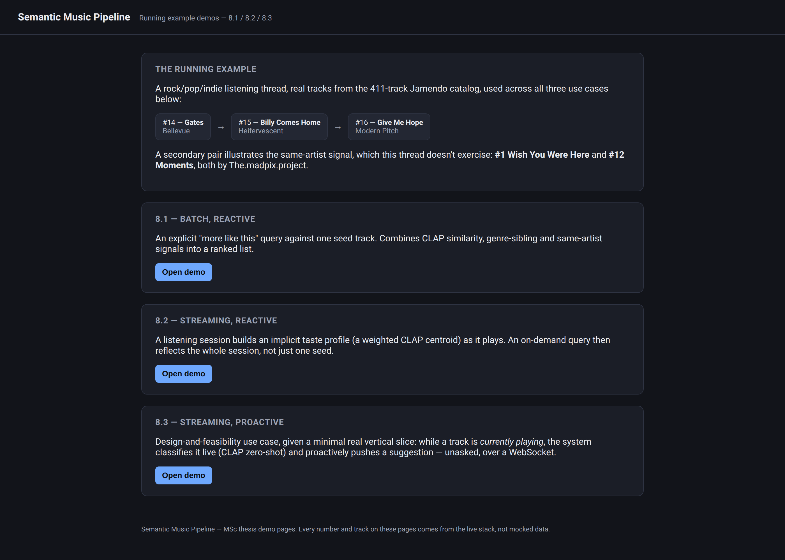

# 1. Introduction

Modern music systems operate on large volumes of heterogeneous data originating from multiple modalities, including audio signals, images (e.g. album artwork), video (e.g. music videos), and textual metadata. While these data sources differ in structure and representation, they jointly contribute to the perception, interpretation, and consumption of music.

Raw multimedia data, however, is typically unstructured, noisy, and difficult to interpret at a semantic level. Low-level features extracted from different modalities (spectral characteristics in audio, visual patterns in images) do not directly correspond to human-understandable concepts like mood, genre, or usage context. This discrepancy is commonly referred to as the semantic gap.

This thesis proposes a data-driven multimedia pipeline designed to process heterogeneous inputs in a unified, input-agnostic manner within the music domain, transforming raw static and streaming data into structured, semantically enriched representations that support a variety of downstream applications. The architecture is general and modular, enabling multiple specialized pipelines to be generated for different tasks; several application scenarios are presented, spanning both batch and real-time use cases.

## 1.1 Motivation

Personalization has become core infrastructure for commercial music and media platforms, not a peripheral feature bolted onto a catalog. Netflix's own account of its recommendation architecture describes a layered system (offline, nearline, and online) built specifically so that many different algorithms and applications can share the same underlying signals rather than each maintaining its own [1], and a companion analysis of that system's business value estimates its contribution at over a billion dollars a year in retained subscriptions [2]. Industry-wide, McKinsey's 2021 personalization report finds that companies excelling at personalization generate substantially more revenue from those activities than average players, and that a large majority of consumers now expect a personalized interaction as the default rather than the exception [3]. For a music streaming platform specifically, the same dynamic applies to matching a listener's next track: recommendation quality is not a research curiosity but a driver of engagement and retention that companies invest in accordingly.

That commercial motivation, however, only justifies building a recommender at all; it does not by itself justify the specific architectural choice this thesis makes: a single semantic layer serving multiple downstream applications, rather than one bespoke recommendation model per feature. That choice has an academic motivation. Collaborative filtering, the dominant paradigm for large-scale recommendation, degrades precisely where a catalog is least uniform: a new or unpopular track has no interaction history to collaborate on, a long-identified failure mode known as the cold-start problem, and even once a track accumulates plays, purely collaborative signals are known to systematically over-recommend already-popular items at the expense of the rest of the catalog [4], [5]. Van den Oord et al. address the cold-start case directly by predicting, from audio content alone, the latent factors a collaborative model would otherwise have had to learn from listening history [4]. This is the same intuition this thesis's Recommender Engine acts on, using CLAP similarity as a signal independent of any listening history at all. A semantic layer addresses the second failure mode, popularity bias, differently: not by re-ranking around it after the fact [5], but by supplying additional, content-grounded and graph-grounded signals (genre-sibling and same-artist relationships, in this thesis's case) so that a track's exposure does not depend solely on its accumulated interaction count. Knowledge-graph-based recommendation research has established both of these benefits together: Oramas et al. showed that grounding recommendation in a knowledge graph over open metadata improves interpretability and cold-start handling relative to purely collaborative approaches [6], a result this thesis's use of explicit genre-sibling and same-artist signals directly applies over its own knowledge graph, rather than re-deriving the same claim from scratch.

The second half of the architectural motivation (one shared Semantic API rather than a model built into each application) follows from an existing taxonomy rather than being argued from scratch here. Adomavicius and Tuzhilin's account of context-aware recommendation treats the recommendation function itself as parametrized by context (time of day, activity, session state, inferred intent), with different applications instantiating different contexts over the same underlying model rather than each requiring a separate one [7]. Auto-tagging, similarity search, playlist generation, and the Recommender Engine this thesis implements are exactly such sibling instantiations: each needs the same enriched, semantic representation of a track, and none of them needs a private copy of it. Treating that representation as a shared, reusable service (the Semantic API) is therefore the architectural response to the same interpretability-and-reuse case the knowledge-graph literature makes for recommendation specifically, generalized to every downstream application this thesis's pipeline supports.

Figure 1.1 puts that argument in its plainest form, independently of any of the literature above. Four applications that each build their own private understanding of a track pay for that understanding four times over, and a track a collaborative model has never seen is cold to all four independently. Four applications reading one shared, already-enriched representation pay for it once, and an improvement to that representation (a better embedding, a richer graph) benefits every application built on top of it without touching their code at all. Everything from here on, including the three use cases this thesis builds, is a demonstration of the right-hand side of that picture.

{width=6.3in}

## 1.2 Objectives

-   Design a unified, modular pipeline architecture spanning data ingestion, semantic enrichment, and application layers, applicable across modalities (audio, image, video, text) and processing regimes (batch and streaming).

-   Define a generic Semantic API as the shared building block between the pipeline's semantic layer and any number of downstream applications, avoiding an architecture coupled to a single use case.

-   Demonstrate the architecture concretely through a context-aware music Recommender Engine, implemented across three independent use-case modes: batch/reactive (8.1), streaming/reactive (8.2), and streaming/proactive (8.3).

-   Implement and empirically verify the batch/reactive mode end-to-end on a real, licensed seed dataset, under an explicit local-CPU compute constraint.

## 1.3 A Running Example

The architecture just described stays abstract until it is grounded in something a reader can actually follow from one chapter to the next. This thesis uses one running example throughout, specialized as needed wherever a chapter introduces a new mechanism, rather than a fresh example per use case: a single listener, three real tracks from the 411-track licensed Jamendo catalog this thesis's dataset is built from, and the same listening thread carried through all three use-case modes.

The thread: a listener plays **"Gates"** by Bellevue (track #14, tagged rock/pop/indie), then **"Billy Comes Home"** by Heifervescent (#15), then **"Give Me Hope"** by Modern Pitch (#16) — three different artists, one coherent genre neighbourhood. A second, secondary pair — **"Wish You Were Here"** and **"Moments"**, both by the same artist, The.madpix.project (#1 and #12) — is introduced later, in Chapter 5, specifically because the primary thread above never exercises the same-artist signal the ranking function also uses; the running example is extended exactly when a chapter needs it to demonstrate something new, not padded out upfront.

The same listening moment means something different under each use-case mode, and that difference is the entire point of the taxonomy in Table 1.1, applied here to the same three tracks:

| Use case | Mode | Type | What the running example does |
|---|---|---|---|
| 8.1 | Batch | Reactive | Explicit query against one seed track ("Gates") |
| 8.2 | Streaming | Reactive | Implicit session profile from all three tracks, queried on demand |
| 8.3 | Streaming | Proactive | Live classification + a pushed suggestion while a track plays, unasked |

: Table 1.1: The use-case taxonomy this thesis builds against.

-   **Use case 8.1 (batch, reactive; Chapter 5)** treats "Gates" as an explicit query: the listener asks, once, for more tracks like this one, and the system answers from that single track alone, with no memory of anything played before or after it.
-   **Use case 8.2 (streaming, reactive; Chapter 6)** treats the same three tracks as a *session*: nothing is asked explicitly, but the system builds an implicit taste profile from all three as they play, and a query issued after "Give Me Hope" gets an answer shaped by the whole session, not by "Give Me Hope" alone.
-   **Use case 8.3 (streaming, proactive; Chapter 6)** treats "Give Me Hope" as a moment to act on unprompted: while it is playing, the system classifies it live and pushes a suggestion to the listener before they ask for one.

Figure 1.2 shows this thread as it actually runs against the live system — not a mock-up, a screenshot of the demonstration pages this thesis's implementation chapters revisit for each use case (Figures 5.7, 6.10 and 6.11).

{width=6.3in}

## 1.4 Thesis Structure

Chapter 2 states the problem this thesis addresses. Chapter 3 surveys the relevant state of the art across Music Information Retrieval, knowledge graphs, stream processing, and multimodal representation learning. Chapter 4 presents the confirmed system architecture and technology stack. Chapter 5 describes the implementation and verification of use case 8.1. Chapter 6 reports the design and empirical results of use case 8.2 (streaming, reactive) and use case 8.3 (streaming, proactive): 8.3's design and feasibility analysis, plus a minimal real demonstration slice built to show the mechanism working end-to-end, distinct from the full empirical evaluation 8.1 and 8.2 each received. Chapter 7 concludes and outlines future work.
