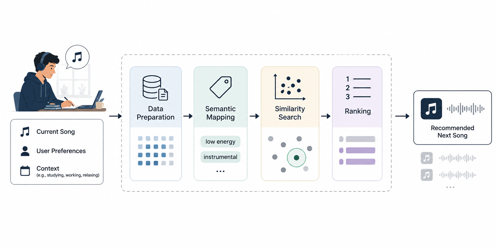

# 2. Problem Statement

Music-related data presents several challenges due to its heterogeneous and dynamic nature. Different modalities require distinct preprocessing techniques and feature-extraction methods: audio needs signal-level analysis, images need visual feature extraction, text needs natural-language processing. Yet a system serving all of them cannot afford a separate, incompatible pipeline per modality without losing the ability to reason across modalities at all. Real-world data further contains noise, redundancy, and inconsistencies: duplicate recordings under different identifiers, inconsistent or missing genre tags, and metadata that disagrees across sources, all of which a pipeline built only for a clean, pre-curated dataset would silently mishandle. The increasing importance of real-time interaction in modern platforms introduces a further requirement: user behavior, listening context, and external signals are continuously generated as data streams, requiring systems to process information incrementally rather than in isolated batches, and to do so without duplicating the enrichment logic a batch pipeline over the same underlying data already implements.

The key challenge addressed in this thesis is the design of a unified pipeline capable of:

-   processing heterogeneous multimedia inputs in a consistent manner, so that audio, image, video, and textual signals about the same entity converge on one representation rather than several incompatible ones;

-   supporting both batch and streaming data, without maintaining two independently evolving implementations of the same enrichment logic;

-   integrating modality-specific representations into a shared semantic space, so that similarity and relatedness can be computed across, and not only within, a single modality;

-   mapping low-level features to high-level semantic concepts (genre, mood, usage context) that downstream applications can reason about directly, closing the semantic gap introduced in Section 1.1;

-   enabling adaptability to dynamic user context, so that the same underlying representation can support both an explicit, on-demand query and a continuously updated, session-scoped one.

These challenges are not unique to music, but music data has structural properties that make them acute rather than incidental. A track is never an isolated unit: it participates in a dense web of relationships (artist, album, genre, era, mood, cultural context) that a purely feature-based representation discards, and that a knowledge-graph-shaped answer to the third bullet above is specifically meant to preserve. Music consumption is also unusually session-structured compared to, say, document retrieval: a listener's next relevant item depends on what they just heard, which is precisely the dynamic-context requirement the fifth bullet states, and which most classical information-retrieval pipelines, built around a single stateless query, do not model at all. Finally, open, licensable, and real-time-accessible sources for music specifically are more constrained than for generic multimedia or text: streaming rights, per-track licensing, and content take-downs mean the seed dataset a system can legally and reproducibly evaluate against is necessarily smaller and more curated than the catalog a production system would eventually serve (Section 3.10 details the specific sources evaluated and rejected for this reason).

Without such a unified framework, downstream applications suffer from limited interpretability, reduced responsiveness, and poor integration across data sources: each would need to solve heterogeneity, the semantic gap, and the batch/streaming split independently, for itself, rather than inheriting a shared solution. Chapter 3 surveys the state of the art against exactly these three challenges (heterogeneous multimedia processing, bridging the semantic gap, and unifying batch and streaming processing) before Chapter 4 presents the architecture this thesis proposes in response.

Figure 2.1 makes the fifth bullet above concrete before Chapter 4 formalizes it. A listener's current song, stated preferences, and context (studying, working, relaxing) enter a pipeline that prepares the data, maps it into the shared semantic space the fourth bullet calls for, searches that space for similar items, and ranks the result into a single next song. Every stage in the diagram is a named component this thesis actually builds: "Data Preparation" and "Semantic Mapping" are Chapters 4's Layer 1 and Layer 2, "Similarity Search" is the Milvus lookup Chapter 5's Recommender Engine calls over the Semantic API, and "Ranking" is the scoring function Section 5.6.1 describes in full. Chapter 5 revisits this exact flow against a real seed track from the running example, "Gates," rather than the generic listener shown here.

{width=6.3in}
