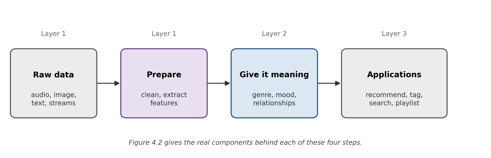

# 4. System Architecture

The proposed system is structured as a modular, extensible, input-agnostic pipeline composed of three layers: Data Preparation, Semantic Enrichment, and a Semantic API / Application layer. The pipeline supports both batch processing of static datasets and stream processing of continuous, real-time data, allowing multiple specialized processing flows to be generated from the same underlying architecture.

Figure 4.1 gives the shape of that pipeline before the sections below name its actual components: raw multimodal data is prepared, given semantic meaning, and handed to applications, in that order, regardless of which technology sits behind any one step. Figure 4.2 (Section 4.3) is the same pipeline with every step's real name attached.

{width=6.4in}

Table 4.1 states plainly what that duality means before the layer-by-layer description below gets specific about it. The architecture is Kappa-inspired rather than Lambda-style (Section 4.4): batch is the primary paradigm, and the streaming path is a real-time extension of the same enrichment logic rather than a second, independently maintained implementation of it.

| Aspect | Batch (this thesis's 8.1) | Stream (this thesis's 8.2/8.3) |
|---|---|---|
| Input | A static catalog of media files | A continuous event stream |
| Processing | The full dataset at once | Incremental, window-based |
| Latency | Seconds per query, minutes for a full catalog pass | Milliseconds to seconds per event |
| Trigger | An explicit, one-off query | A continuously updated session |
| State | Stateless between queries | Stateful (session profile, sliding windows) |

: Table 4.1: Batch and streaming processing, as this thesis's own use cases instantiate the distinction (not a generic industry comparison — the specific latencies and triggers are measured in Chapters 5 and 6).

## 4.1 Layer 1: Data Preparation

Responsible for transforming raw inputs into structured representations: cleaning, deduplication, normalization, and modality-specific feature extraction (audio: tempo, spectral features, MFCCs; image: color/texture/visual embeddings; video: motion/temporal features; text: embeddings and keyword extraction). Streaming inputs are processed incrementally over time windows rather than requiring a complete dataset. Storage is split by concern into three distinct systems, each addressing a different access pattern: object storage (MinIO/S3) for raw media blobs, a columnar feature store (Parquet/Delta Lake) for extracted numerical features, and PostgreSQL as the relational system of record for track metadata.

## 4.2 Layer 2: Semantic Enrichment

Maps structured features into a shared semantic space via a knowledge graph representing domain knowledge: genres, moods (e.g. relaxing, energetic), functional labels (e.g. focus, workout, chill), and the relationships between entities. For streaming data this layer is stateful, maintaining temporal context and updating semantic representations dynamically as new data arrives. CLAP embeddings populate a vector index (Milvus) for similarity search, while the Neo4j graph captures discrete relational structure (artist, genre, and related-entity edges); the two are joined on a common key (the MusicBrainz recording ID where available, or the pipeline's own internal track ID otherwise) so that the Semantic API layer can combine continuous-similarity and discrete-relational signals for the same entity.

This split between a vector index for continuous similarity and a graph for discrete relational structure follows directly from the two lines of research Chapter 3 surveys: Milvus is the vector-database category Chapter 3 grounds in [16], and the design choice to expose genre-sibling and same-artist relationships as explicit, traversable graph edges (rather than folding them into a single learned embedding, as KGAT and RippleNet do [21], [22]) follows Gabbolini and Bridge's case for interpretable, path-based similarity over an opaque one [20], and Bertram, Dunkel and Hermoso's demonstration that an open-metadata music knowledge graph alone, without a deep collaborative model layered on top of it, already supports meaningful recommendation [19]. The IVF_FLAT index configuration itself (Section 5.5.4) is an instance of the indexing-speed-versus-recall trade-off Chapter 3 raises for ANN search in general, not a decision specific to this dataset.

## 4.3 Layer 3: Semantic API / Application

Consumes the semantically enriched representations to generate outputs tailored to specific use cases. The Semantic API is a generic, shared building block reused across multiple Layer-3 applications (Recommender Engine, Similarity Search, Auto-tagging, and Playlist Generation) rather than being defined by any single one of them; this thesis's Recommender Engine is one consumer of that API, not its specification. This separation between pipeline and application is what gives the architecture its reusability: new applications can be built on the same semantic substrate without redesigning the underlying pipeline.

![Figure 4.2: The three-layer pipeline architecture -- Figure 4.1's four steps, with every real component attached. Layer 1 ingests raw media and behavioural events over separate Kafka topics and lands them in three stores chosen by access pattern: object store, columnar feature store, relational metadata database, joined on a common MusicBrainz identifier. Layer 2 extracts modality-specific features via batch (Spark) and streaming (Kafka/Flink) enrichment paths, projecting the resulting structure into a knowledge graph (Neo4j) while a separate embedding step (CLAP) populates a vector index (Milvus). Layer 3 exposes the enriched catalog through one shared Semantic API; the Recommender Engine (starred) is a single downstream consumer of it, a sibling of auto-tagging, similarity search and playlist generation rather than the API's specification. Colour marks category (orange for Kafka topics, green for stores, purple for compute/enrichment, blue for services), not a literal shape convention.](figures/fig-4-2-architecture.png){width=6.4in}

## 4.4 Technology Stack

Every technology in the stack is open-source and self-hostable, and the entire prototype is scoped to run on local CPU hardware by capping the seed dataset at 200-500 tracks, resolving the compute-feasibility question without altering the architecture itself.

  --------------------------------------------------------------------------------------------------------------------------------
  **Component**           **Technology**          **Role**
  ----------------------- ----------------------- --------------------------------------------------------------------------------
  Metadata store          PostgreSQL              System of record for track/entity metadata

  Graph store             Neo4j                   L2 knowledge graph (artist, genre, relations)

  Vector store            Milvus                  L2 CLAP embedding index, similarity search

  Object store            MinIO / S3              L1 raw media storage

  Event streaming         Apache Kafka            L1/L2 media & behavioral event topics (streaming use cases)

  Stream processing       Apache Flink            Stateful windowed enrichment (streaming use cases)

  Batch processing        Apache Spark            Distributed batch feature extraction / KG construction, at catalog scale

  Orchestration           Apache Airflow          Batch pipeline DAG scheduling

  Session cache           Redis                   Session state for streaming use cases (8.2/8.3), fed by a platform-owned Kafka consumer, not Flink (Decision B)

  Application API         FastAPI                 L3 Semantic API and application services
  --------------------------------------------------------------------------------------------------------------------------------

  : Table 4.2: The technology stack as built. Compare against Table 3.4 (Section 3.11), the pre-implementation recommendation this narrowed down from.

Kafka topics are deliberately separated by concern (media streams are not conflated with behavioral event streams), and the architecture follows a Kappa-style approach in which batch is the primary processing paradigm and streaming is treated as a real-time extension of the same logic, avoiding the duplicated business-logic maintenance burden of a Lambda architecture.

Every component listed above is open-source and self-hostable, which is a constraint on the selection, not an incidental property of whatever happened to be chosen. A managed, proprietary equivalent exists for nearly every row (a hosted vector search API in place of Milvus, a managed graph database in place of Neo4j, a managed streaming platform in place of Kafka/Flink), and any one of them would very likely outperform the self-hosted stack on a large enough workload. None of them, however, would let this thesis's evaluation packs (Sections 5.5 and 6.1) inspect and reason about the system's internals the way Section 3.9's reproducibility discussion requires: knowing that the Milvus collection's index is `IVF_FLAT` with 128 clusters queried across 16 (Section 5.5.4), for instance, is only possible because the index configuration is a parameter this thesis's own code sets, not an opaque managed service's internal default. Self-hostability is therefore also a methodological choice, not only a cost one: it is what makes the noise-floor and repeatability measurements in Chapters 5 and 6 possible to run and interpret at all.

## 4.5 Use Case Taxonomy

The Recommender Engine (the demo application used throughout this thesis) is decomposed into three independent modules, confirmed for full prototype implementation:

  -------------------------------------------------------------------------------------------------------------------------
  **Use case**      **Mode**               **Trigger**                                                    **Transport**
  ----------------- ---------------------- -------------------------------------------------------------- -----------------
  8.1               Batch, reactive        Explicit query against a static/batch context                  REST

  8.2               Streaming, reactive    Explicit query within a live session                           REST

  8.3               Streaming, proactive   System-inferred, no explicit query, from a live-played track   WebSocket
  -------------------------------------------------------------------------------------------------------------------------

Use case 8.2's transport was revised from WebSocket to REST during implementation, and the table above records the revised value; the reasoning is given in Section 6.1.2, since it turns on the distinction between 8.2 and 8.3 rather than on a transport preference. 8.3's remains WebSocket, push delivery being the natural transport for a use case in which the user never asked.

For 8.2 and 8.3, Redis serves as a session cache (distinct from PostgreSQL's role as the system of record), fed by the platform-owned Kafka consumer that reads the behavioral-events topic and, on the same poll, writes each event to both Redis (under a sliding 30-minute TTL) and PostgreSQL directly, rather than through a separate stream-processing job (Decision B). For 8.3, Auto-tagging is reused as a classifier-only building block inside the Semantic API, with no live persistence to Neo4j during the streaming session. Use case 8.3's implementation simulates a live audio stream via a Creative-Commons clip served through the Freesound API, rather than live hardware capture.
