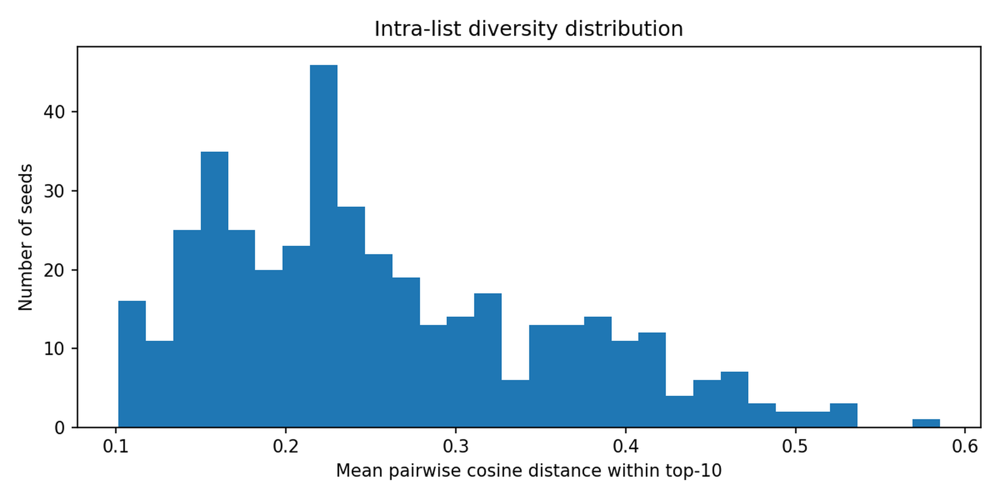
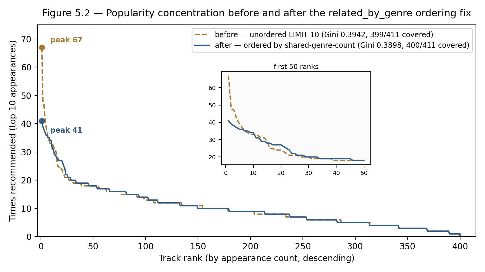

# 5. Implementation: Use Case 8.1 (Batch, Reactive Recommendation)

This chapter documents the implementation and verification of the batch/reactive Recommender Engine, the first of the three confirmed use-case modes to be built. The build follows the confirmed six-stage order: environment provisioning, seed ingestion, semantic enrichment, the Semantic API, the Recommender Engine, and end-to-end verification.

## 5.1 Scope and Deviation from the General Architecture

The general pipeline architecture (Chapter 4) assigns Apache Spark to Layer-1 batch feature extraction and the Kafka-Flink pair to Layer-2 streaming enrichment. The 8.1 prototype implements neither, by deliberate design rather than omission. The seed dataset is capped at 200-500 tracks specifically to keep CLAP inference feasible on local CPU hardware; at this scale, a distributed batch engine has no workload to meaningfully distribute — enrichment processes the dataset as a sequential loop in batches of 8 tracks, completing in approximately 4 minutes wall-clock, CPU-only. Kafka and Zookeeper are provisioned in the Docker Compose environment from the first build stage, anticipating their role in the streaming use cases (8.2/8.3), but no producer or consumer exists yet in the 8.1 codebase. Introducing Flink-based stream processing at this stage would apply a streaming solution to a use case that, at this scale and in this batch/reactive mode, does not require one. Spark and Flink remain part of the confirmed technology stack; their absence here is a scope boundary of this specific use case, not a retraction of the architecture defined in Chapter 4.

## 5.2 Runtime Environment

The environment is defined in a single Docker Compose configuration provisioning: PostgreSQL 16 (metadata, system of record), MinIO (Layer-1 object storage for raw audio), Neo4j 5 Community (Layer-2 knowledge graph), Milvus 2.4.5 standalone — with its own dedicated etcd and MinIO-backed internal metadata/object store, kept distinct from the Layer-1 MinIO instance — for CLAP embedding storage and similarity search, and Kafka with Zookeeper plus Redis, both provisioned ahead of the streaming use cases and unused at this stage.

## 5.3 Pipeline Stages

### 5.3.1 Stage 2 — Seed Dataset Ingestion

The seed dataset was sourced from the Jamendo API rather than the Free Music Archive originally listed as a candidate in the state-of-the-art survey — a disk-budget decision: Jamendo serves tracks individually via a free API key, so download footprint scales with what is actually kept (approximately 2.3 GB for the 411 tracks retained), whereas FMA is distributed as one archive per split, with even the smallest split requiring a roughly 7.2 GB download before any subsetting is possible.

Each track is uploaded to MinIO, fingerprinted via Chromaprint, and linked on a best-effort basis to MusicBrainz via AcoustID. The dataset settled at 411 unique tracks against an initial 500-track target: Jamendo's popularity-based pagination is not perfectly stable across separate HTTP requests, producing roughly 90 duplicate entries on a second fetch pass, which were discarded via a database-level uniqueness constraint on the source identifier. 411 tracks remains within the project's confirmed 200-500 seed range, so no further fetching was pursued.

The AcoustID-to-MusicBrainz match rate reached 49.4% (203 of 411 tracks) — an expected outcome rather than a defect, since a substantial share of Jamendo's catalog consists of independent, self-released music that was never submitted to MusicBrainz. The pipeline treats a missing MusicBrainz identifier as a normal case rather than an error condition; this is itself a legitimate empirical observation about the partial nature of fingerprint-based linkage for non-mainstream corpora, worth reporting as a finding rather than only as an implementation detail.

  -------------------------------------------------------------------------
  **Metric**                            **Value**
  ------------------------------------- -----------------------------------
  Tracks ingested                       411 (target 500)

  Total audio size in object storage    2.31 GB

  Duration range / mean                 76s - 953s / 231s

  Distinct genre tags                   77

  AcoustID -> MusicBrainz match rate   49.4% (203 / 411)
  -------------------------------------------------------------------------

: Table 5.1 — Stage 2 seed dataset, as ingested.

Verified by five automated tests: dataset size within the confirmed seed range, absence of duplicate source identifiers, presence of a fingerprint for every row, referential parity between the relational store and object storage, and duration plausibility bounds.

### 5.3.2 Stage 3 — Semantic Enrichment

A 512-dimensional CLAP audio embedding is computed for every track (LAION-CLAP 1.1.6, non-fusion configuration, the pretrained 630k-AudioSet checkpoint, CPU-only) and indexed in Milvus using an IVF_FLAT index under the cosine similarity metric. Independently, a (:Artist)-[:PERFORMED]->(:Track)-[:HAS_GENRE]->(:Genre) subgraph is materialized in Neo4j directly from the relational metadata already present after Stage 2 — this is a structural projection of existing data into a graph representation, not a step that infers new information. The enrichment job is idempotent, guarded by a per-track enriched timestamp, so partial or interrupted runs can be resumed safely rather than reprocessed from scratch.

All 411 tracks were enriched with zero failures; wall-clock time was approximately 4 minutes at a batch size of 8, i.e. roughly 0.6 seconds per track — concrete evidence that the 200-500-track scale constraint achieves its intended purpose of CPU feasibility without a GPU. The internal track identifier is deliberately reused as the join key across PostgreSQL, Milvus, and Neo4j, directly implementing the architecture's principle of a common key linking every storage component.

  ----------------------------------------------------------------------------
  **Metric**                               **Value**
  ---------------------------------------- -----------------------------------
  Tracks enriched                          411 / 411 (100%)

  Milvus vectors (dim)                     411 (512)

  Neo4j :Track / :Artist / :Genre nodes    411 / 201 / 77

  :PERFORMED / :HAS_GENRE relationships    411 / 764

  Wall-clock (411-track batch, CPU-only)   ~4 min (~0.6 s/track)
  ----------------------------------------------------------------------------

: Table 5.2 — Stage 3 semantic enrichment over the full catalog.

Verified by six automated tests confirming row-count and identifier parity between the relational store, the vector index, and the graph, in both directions.

### 5.3.3 Stage 4 — Semantic API

A single, read-only FastAPI service exposes six endpoints over the three Layer-1/Layer-2 stores: health, single-track metadata, similarity search, a per-track graph view (artist, genres, genre-sibling tracks), artist-scoped track listing, and genre-scoped track listing. A shared connection lifecycle — a pooled PostgreSQL connection pool, one persistent Milvus collection handle, and one Neo4j driver — is opened once at process startup and closed at shutdown, exposed to route handlers via dependency injection rather than being managed ad hoc per request.

The API deliberately exposes no catalog-enumeration endpoint (no "list all tracks"): its fixed surface is scoped to reading about a known entity, which any Layer-3 consumer needs, rather than to enumerating the full catalog, which is specific to a batch job's own iteration needs. This keeps the API generic rather than shaped around the Recommender Engine's particular requirements — a concrete implementation of the pipeline-versus-application separation from Chapter 4.

Verified by seven automated tests plus manual endpoint verification against the live 411-track dataset, covering health reporting, metadata retrieval, 404 handling for unknown identifiers, similarity-search correctness (exact k, self-exclusion, descending order), and artist/genre lookup correctness.

### 5.3.4 Stage 5 — Recommender Engine

The Recommender Engine adopts a seed-track trigger model rather than a fabricated user/session identity: a trigger is a single existing track identifier, standing in for "this track was just played or selected" — matching a "fans also like" or "up next" style of recommendation. This was a deliberate choice: no user or behavioral data exists anywhere in the pipeline at this stage (Kafka is provisioned but unwired, and behavioral-event topics are explicitly scoped to the streaming use cases), so a user-personalized design at this stage would have required fabricating a data model the rest of the pipeline does not yet have.

The engine is organized into three modules. The trigger handler resolves which track identifiers a batch invocation should process — either a single explicit seed or the full catalog, optionally capped — reading the identifier column directly from PostgreSQL as a narrow, documented exception to the "everything through the Semantic API" rule: this is batch work-item bookkeeping, not a semantic read of track content, and the API deliberately has no catalog-listing endpoint for a trigger handler to call instead. The context builder gathers three candidate sources for a given seed track entirely over HTTP from the Semantic API — similarity candidates, genre-sibling tracks, and same-artist tracks — and never queries any of the three underlying stores directly, enforcing the same API boundary described in Section 5.3.3. Ranking is a pure, side-effect-free function merging the three sources into one deduplicated, scored, descending-sorted list.

The ranking formula is an additive weighted sum:

score = similarity

+ 0.05 if the candidate is a genre sibling of the seed

+ 0.15 if the candidate is by the same artist as the seed

The two boost magnitudes are grounded in the dataset's own sparsity statistics rather than chosen arbitrarily: 764 genre relationships across 77 genres give roughly 9.9 tracks per genre on average, making genre co-membership a coarse, comparatively low-precision signal that receives a small boost; 411 tracks across 201 artists give roughly 2.0 tracks per artist, making shared authorship a rare, high-precision signal that receives a larger one. Both boosts remain well under similarity's own approximate [0,1] range, so they function as re-ranking nudges and tie-breakers rather than overriding the acoustic similarity signal outright; because boosts stack additively, a candidate confirmed relevant by more than one source ranks above one confirmed by only one. This is documented, explicitly, as a tunable heuristic appropriate to a prototype at this scale — 411 tracks, no ground-truth relevance labels — rather than a learned or empirically validated ranking model. Reciprocal Rank Fusion was considered as a more conventional alternative and rejected: the genre-sibling and same-artist candidate lists returned by the graph store are not meaningfully ordered, so a rank-based fusion method would not add real rigor over a documented membership boost at this scale.

Sanity-checked against real output for seed track 1 ("Wish You Were Here" by The.madpix.project): the top-ranked recommendation, by the same artist, scored exactly its raw similarity plus the artist boost; a third-ranked recommendation, a genre sibling only, scored exactly its raw similarity plus the genre boost — confirming both boosts apply precisely as designed rather than only in aggregate.

Across the full batch of 411 seed tracks, 4,110 recommendation rows were generated (100% success, zero self-recommendations, exactly the configured top-k for every seed), with scores ranging from 0.181 to 1.179 (mean 0.794). The ceiling above 1.0 is an expected consequence of the additive boosts stacking on top of a similarity score that is not strictly re-normalized back into [0,1], and is called out here so it does not read as a defect: 203 rows, 4.94% of the batch, score above it (Figure 5.1).

These three numbers describe that batch run exactly as it was executed at this stage, **before** the genre-query fix reported in Section 5.5.3, and Figure 5.1 plots that same original run. The evaluation in Section 5.5 reports the corrected pipeline, whose 4,110 scores span 0.1790 to 1.1789 with a mean of 0.7941. The difference is confined to the third and fourth decimal — the fix changed which candidates the genre boost reached, not the scale on which they are scored — and both readings are labelled here so that the pair is not read as a discrepancy.

![Figure 5.1 — Score distribution across the 411-seed batch run, as originally executed in this stage and before the genre-query fix of Section 5.5.3. The shaded region holds the 203 rows (4.94%) scoring above 1.0, where the additive boosts stack on a similarity score that is not re-normalized back into [0,1].](figures/fig-5-1-score-distribution.png){width=6.0in}

Verified by seven unit tests against the pure ranking function (synthetic candidates, no live services) and one integration test running the batch entrypoint against the live stack end-to-end.

### 5.3.5 Stage 6 — End-to-End Verification

A dedicated end-to-end suite traces three "golden" tracks through every layer of the pipeline in a single test run — relational store and object storage, vector index and graph, Semantic API, and Recommender Engine — asserting data consistency at each hop. This complements, rather than duplicates, the twenty-seven stage-specific tests from Stages 2-5, each of which already verifies its own stage's output is internally consistent; what none of them individually prove is that one piece of data remains consistent as it flows through all five stages together. Stage 6 closes that specific gap.

The suite runs against the live, already-populated stack rather than performing a destructive from-scratch rebuild — a deliberate, documented scope decision, since a full rebuild is slow, destroys the current verified dataset until it completes, and re-consumes rate-limited external API quota for no additional correctness benefit beyond what lineage tracing already provides. The full rebuild sequence is preserved as an on-demand runbook, intended for a reproducibility demonstration at the thesis defense rather than for routine execution.

Building this stage surfaced one genuine integration bug, not merely a test-writing exercise: a Milvus connection-alias collision between the Semantic API's in-process test client and the test suite's own shared fixture caused the API's shutdown handler to silently tear down the vector-database connection used by later, unrelated tests in the same session. The fix — a dedicated connection alias for the API, isolated from the test suite's own alias — is a concrete example of an integration-level defect that per-stage unit testing alone could not have caught, and is reported here as a finding, not only as a changelog entry.

Final verification state: 32 of 32 tests passing across all six build stages, over the full 411-track dataset.

## 5.4 Summary

  --------------------------------------------------------------------------------------------------------------------------
  **Stage**                           **Outcome**
  ----------------------------------- --------------------------------------------------------------------------------------
  1 — Environment                     Docker Compose: Postgres, MinIO, Neo4j, Milvus, Kafka, Redis

  2 — Ingestion                       411 tracks (Jamendo -> Postgres/MinIO), 5/5 tests

  3 — Enrichment                      411/411 embedded (CLAP) + graphed (Neo4j), 6/6 tests

  4 — Semantic API                    6 endpoints, FastAPI, 7/7 tests

  5 — Recommender Engine              411/411 seeds, 4,110 recommendations, 8/8 tests

  6 — End-to-end                      3 golden tracks traced across all layers, 5/5 tests, 1 integration bug found & fixed
  --------------------------------------------------------------------------------------------------------------------------

: Table 5.3 — Use case 8.1, stage by stage.

32/32 tests pass across the whole suite. Kafka and Redis remain provisioned but intentionally unwired at this stage, reserved for the streaming use cases described in Chapter 6.

## 5.5 Results: Evaluating Use Case 8.1

Stage 6 established that the pipeline runs end to end. It established nothing whatsoever about what the pipeline *produces*. `eval/8_1` is a separate, read-only evaluation pack, written after the build order had closed, that asks the second question against the 411 seeds and 4,110 recommendation rows the batch run left behind: what explains each recommendation, how much of the catalog is reachable, how varied a single list is, where the time goes, what the graph underneath actually looks like, and whether any seed was served badly.

### 5.5.1 The Pack and Its Methodological Commitments

Four commitments determine what the numbers in this section can and cannot be asked to support. Three of them are shared with the streaming evaluation in Chapter 6; the fourth is where the two chapters differ, and it differs in this chapter's disfavour.

**The evaluation reads a frozen output rather than driving the system.** The recommendations were generated once, by a single batch invocation over the whole catalog, and every metric is computed against stored rows. Nothing in the pack re-runs the recommender, and no metric depends on the order in which the pack's own code executes. One consequence has to be stated rather than glossed: the finding reported in Section 5.5.3 postdates that batch run, so the canonical results below are computed not against the original stored table but against a **reconstruction** of what the corrected pipeline produces for the same 411 seeds. That reconstruction was validated against the real recommender before any number was taken from it, under the rule described in Section 5.5.4. The original, uncorrected table is retained unmodified alongside it, and every before/after pair in Section 5.5.3 is the same key read out of the two files.

**No accuracy metric is reported, and none could be.** There is no ground truth and there are no real users for this dataset, so precision@k, recall@k and NDCG would all require relevance labels that do not exist. The pack measures systems and behavior — what the ranking is made of, how far it spreads, how fast it runs, how it is shaped by the graph beneath it — and says nothing about whether a recommendation is good. Chapter 6 takes the same position for the same reason.

**Where the pack reconstructs something, it reconstructs it exactly rather than approximately.** The stored recommendation rows persist only a final score, not which signals produced it, so the signal contribution in Section 5.5.2 has to be rebuilt from the stores. Rebuilding it from the *complete* genre-tag overlap disagrees with the stored scores, because that is not the candidate set the batch run actually saw; rebuilding it from the same capped, ordered query the pipeline issues brings the disagreement to zero rows in 4,110. The metric reports that self-consistency count as part of its own output, so a reconstruction error would be visible in the results rather than silently absorbed into them.

**Nothing in this pack was pre-registered, and Chapter 6's stronger claim does not extend backwards to it.** Section 6.1.7 reports that every pass/fail rule in the streaming evaluation was committed before the run it judges. No equivalent claim can be made here, and the reason is structural rather than an oversight: this pack was written against a table that had already been generated, so the numbers existed before the questions did, and there was nothing left to pre-register against. Metrics 1 to 6 are therefore descriptive measurements with no thresholds and no verdicts, and none is reported below as a pass or a failure. The single exception, which judges the reconstruction path rather than the recommender, is stated at its true strength in Section 5.5.4.

### 5.5.2 Results, Metric by Metric

**Metric 1 — signal contribution.** Every one of the 4,110 rows reached the ranking function through the similarity pool: the graph signals are additive boosts on a similarity score, never an independent route into the list. Within that, 3,055 rows (74.33%) carry no boost at all, 454 (11.05%) carry the same-artist boost, 440 (10.71%) the genre-sibling boost, and 161 (3.92%) both (Figure 5.3). The four classes are mutually exclusive and sum to 4,110 exactly. Read against the ranking design of Section 5.3.4, this says that acoustic similarity decides roughly three recommendations in four unaided, and the graph re-ranks the remaining quarter — which is the intended division of labour between a continuous signal and two coarse membership signals, now measured rather than assumed.

{width=6.0in}

The same metric quantifies a gap between the boost as designed and the boost as delivered. Of the 4,110 rows, **2,184 genuinely share a genre tag with their seed, and 1,583 of those — 72.48% — never received the genre boost.** The cause is a cap: the graph endpoint returns at most ten genre siblings per track, and a genre holding 185 tracks cannot deliver its siblings through it. This is a real, confirmed pipeline behavior rather than a reconstruction artifact, and it is not addressed by the fix in Section 5.5.3, which changed *which* ten siblings are selected and not how many can fit.

**Metric 2 — catalog coverage.** 400 of the 411 tracks appear in at least one recommendation list (97.32%), and the eleven that never appear are the whole of the uncovered catalog. The distribution behind that figure is skewed rather than flat: a Gini coefficient of 0.3898, with the most-recommended single track appearing 41 times across the batch. Coverage this high at this scale is a property of the dataset as much as of the ranker — 411 tracks and 4,110 slots leave little room for a track to be missed — so it is reported as a description of the run, not as evidence that the ranker distributes well.

**Metric 3 — intra-list diversity.** Measured as the mean pairwise CLAP cosine *distance* within each seed's top-10, across all 411 seeds with none skipped: mean 0.2569, median 0.2349, with a p10 of 0.1447 and a p90 of 0.4046 (Figure 5.4). A list of ten tracks selected primarily by acoustic nearest-neighbour search *should* be acoustically tight, so a low number here is the expected behavior of the design rather than a defect; what the spread shows is that the tightness is not uniform, and that some seeds sit in a much denser region of the embedding space than others.

{width=6.0in}

**Metric 4 — latency per stage.** No per-stage timing was recorded during the original batch run, so this was measured fresh against the live stack over all 411 seeds. It is kept in its own output file, deliberately outside the pack's byte-identical-across-runs claim, because a wall-clock measurement is not reproducible in that sense and reporting it as though it were would weaken a claim that otherwise holds literally.

| Stage | p50 (ms) | p95 (ms) | mean (ms) |
|---|---|---|---|
| Milvus ANN search | 3.700 | 5.773 | 4.188 |
| Neo4j graph queries | 4.177 | 7.777 | 5.299 |
| Ranking | 0.220 | 0.499 | 0.224 |
| Total per seed | 8.125 | 13.552 | 9.712 |

: Table 5.4 — Per-stage latency over 411 seeds, measured against the live stack.

The shape is the finding. **The ranking function is not the cost; the stores are.** Merging and scoring three candidate lists takes 0.22 ms at the median, against 7.9 ms for the two store round-trips that supply them, and the graph is marginally the more expensive of the two rather than dramatically cheaper than the vector index. A single seed's full recommendation costs about 8 ms end to end. These are per-stage timings taken in their own measurement pass; they are not a decomposition of the original batch run's wall-clock time, which was never instrumented. What they do establish is that the scoring function itself is close to free, which is what makes it reusable in Chapter 6 on every event of a live session without becoming the bottleneck.

**Metric 5 — knowledge graph connectivity.** The graph holds 411 `:Track`, 201 `:Artist` and 77 `:Genre` nodes. Tracks carry a mean of 1.859 genre edges (median 2, maximum 3). The two graph signals are shaped very differently: artists hold a mean of 2.045 tracks with a median of 1 and a maximum of 20, while genres hold a mean of 9.922 tracks with a median of 3 and a maximum of **185**. That heavy skew is what makes the ten-sibling cap of Metric 1 bite — the mean is inflated by a handful of very large genres, and it is exactly those genres whose siblings cannot fit. It is also the empirical justification, measured after the fact, for the boost magnitudes chosen in Section 5.3.4: shared authorship really is the rarer and more precise signal.

The same metric reports that **59 of the 411 seeds have no genre siblings at all**. For roughly one seed in seven, the genre boost cannot fire under any query, ordered or not.

**Metric 6 — failure and edge cases.** Every seed received the full top-10: zero seeds with fewer than ten recommendations, against an expected top-k of ten. The recommender has no degenerate seeds on this catalog.

### 5.5.3 A Finding the Test Suite Could Not Have Produced

Reconstructing Metric 1 required knowing which genre siblings the pipeline had actually seen, and that is how the following came to light. The Cypher query behind the Semantic API's per-track graph endpoint capped genre siblings at ten with **no `ORDER BY`**. The cap itself is deliberate. The absence of an ordering was not: for any genre larger than ten tracks — and the largest holds 185 — the ten siblings returned were an arbitrary selection made by the database, stable enough to look intentional and grounded in nothing. Every recommendation that depended on the genre boost therefore depended on which ten candidates a cap with no tiebreak happened to surface.

The fix orders candidates by shared-genre count descending, with the track identifier ascending as a deterministic tiebreak, so that the ten siblings retained are the ten with the most in common with the seed. Table 5.5 reports what changed, each pair being the same key read from the pre-fix and post-fix result files.

| Quantity | Before (unordered cap) | After (ordered cap) |
|---|---|---|
| Maximum appearances, single track | 67 | **41** |
| Gini coefficient | 0.3942 | **0.3898** |
| Tracks covered | 399 / 411 (97.08%) | 400 / 411 (97.32%) |
| Rows sharing a genre tag with their seed | 2,200 | 2,184 |
| … of those, never given the genre boost | 1,600 (72.73%) | 1,583 (72.48%) |
| Mean intra-list diversity | 0.2562 | 0.2569 |
| Seeds with fewer than 10 recommendations | 0 | 0 |

: Table 5.5 — The `related_by_genre` ordering fix, before and after. Every pair is the same metric key read from the two result files.

**The two headline numbers disagree about the size of the fix, and both are reported.** The most-recommended track's appearance count falls from 67 to 41, a drop of 38.8% in the worst single-track concentration. The Gini coefficient moves from 0.3942 to 0.3898 — a change of 0.0044, about 1.1% of its pre-fix value. They disagree because they measure different things: Gini describes the whole distribution, and the fix acted almost entirely on its head. Figure 5.2 shows precisely that, with the two curves separating sharply over the first thirty ranks and lying on top of each other thereafter. Presenting the peak drop alone would oversell the fix; presenting the Gini shift alone would bury it.

{width=6.0in}

The scope of the change is wider than those summary statistics suggest. Of the 4,110 rows, **1,741 differ** between the two runs; of the 411 seeds, 217 saw a change in *which* tracks they recommend, 60 saw the same tracks reordered, and 134 were untouched. Eleven of those 134 "untouched" seeds nonetheless carry a score difference of exactly ±0.05 — one candidate whose genre-sibling status flipped without its rank changing. That the classification counts them as unaffected is a limitation of a classification defined over track identifiers, and it is recorded in the pack's output rather than corrected after the fact.

What the fix does **not** do is close the gap in Metric 1. The share of genuine genre-tag overlaps that never receive the boost moves from 72.73% to 72.48%. Ordering changed which ten siblings are selected; it did not change how many can fit, and raising the cap is a larger change that was deliberately left out of scope. The open limitation is the cap, not the ordering.

Two things are worth stating about how this was found. The full automated test suite passed before the fix and after it, and it would have gone on passing indefinitely: no test asserted anything about *which* genre siblings the endpoint returns, because until the evaluation pack reconstructed the boost there was no reason to think the question had an answer worth asserting. **The evaluation pack is the oracle for behavior of this kind; the test suite is regression insurance for behavior already understood.** Accordingly, the fix shipped with a regression test that fails against the old query and passes against the new one, moving this particular behavior from the first category into the second. The pre-fix results are retained unmodified alongside the corrected ones and marked as superseded, so that Table 5.5 compares two recorded states of the system rather than one recorded state and one recollection of it.

### 5.5.4 Repeatability, and the Path the Canonical Numbers Came Through

Because Section 5.5.1 takes its canonical numbers from a reconstruction rather than from the stored table, the reconstruction has to be shown to agree with the real recommender. A naive comparison cannot show it: a difference between the two might mean the paths genuinely diverge, or it might mean the vector index does not return identical results twice. Distinguishing those requires knowing what run-to-run variation actually looks like, so it was measured first.

**The repeated-run noise floor is exactly zero.** The real batch entrypoint was run five times end to end under fresh identifiers, and all ten pairwise comparisons were taken: zero seeds with changed membership, zero seeds reordered, and a maximum score delta of 0.0 across **41,100 matched track pairs**. All 411 seeds were classified identical in all ten pairs. This is the measurement Section 6.1.9 draws on when it justifies demanding a score delta of exactly 0.0 from the streaming determinism metric.

The claim carries a bound that the pack records alongside the number, and that bound must travel with it. The Milvus index is `IVF_FLAT` under a cosine metric, built with 128 clusters and queried across 16 of them — genuinely an approximate index, in which a true nearest neighbour can be missed if it falls in an unprobed cluster. The index was not rebuilt between the five runs. What was measured is therefore **run-to-run repeatability against a static index**, not a claim that vector search is unconditionally deterministic, and certainly not a measurement of recall against exhaustive search, which this project never performed.

With the noise floor established, the reconstruction was validated against it under a rule fixed in advance: the reconstruction passes if neither its count of membership-changed seeds nor its maximum score delta exceeds what the noise floor showed. Against a floor of zero on both, this is the strictest form the rule could take. The result is bit-exact agreement — 411 seeds identical, zero membership changes, zero reordering, and a maximum score delta of 0.0 across all 4,110 rows — and the rule returns **pass**.

That rule is the one item in this chapter with any pre-registration claim attached, and it is worth stating at exactly its real strength and no higher. The rule is recorded in the script that applies it, written before the numbers it judges existed; but rule and result entered version control together, so unlike the streaming evaluation's rules — which are committed in an earlier commit than the runs they judge — the ordering here rests on the record in the source file rather than on the commit history. It is reported here because the reconstruction path underpins every canonical number in Section 5.5.2, not because it says anything about recommendation quality.

### 5.5.5 Limitations of the 8.1 Evaluation

Five limitations bound what this section claims, over and above the caveats already stated in place.

- **No accuracy claim is made or possible.** There is no ground truth and there are no users. Every metric here describes what the system does, never whether what it does is good, and the ranking weights of Section 5.3.4 remain an explicitly documented heuristic that this evaluation does not validate.
- **Nothing here was pre-registered.** The pack was written against an already-generated table, so its six metrics are descriptive by construction, and none carries a threshold or a verdict. The one rule with a pre-registration claim judges the reconstruction path, at the reduced strength described in Section 5.5.4.
- **The canonical numbers describe a reconstruction, not a re-executed batch run.** The reconstruction is validated bit-exact against the real recommender, which is the strongest available evidence, but the corrected pipeline has not been run over the full catalog to repopulate the stored table.
- **The genre cap remains, and it is the largest single limitation in the pipeline this chapter builds.** Nearly three quarters of the rows that genuinely share a genre with their seed never receive the boost designed for them, and the fix of Section 5.5.3 does not change that.
- **One dataset, one scale, one machine.** 411 tracks, 77 genres, a single local stack, and latency figures taken from one measurement pass. Nothing here establishes how any of these metrics behaves at a catalog size where the 200–500-track constraint of Section 5.1 no longer holds.
