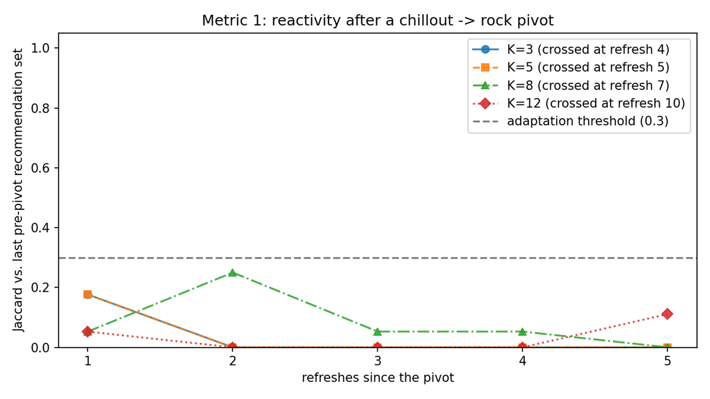
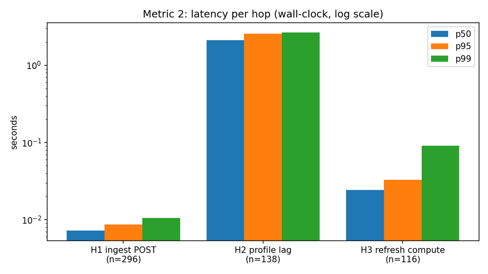
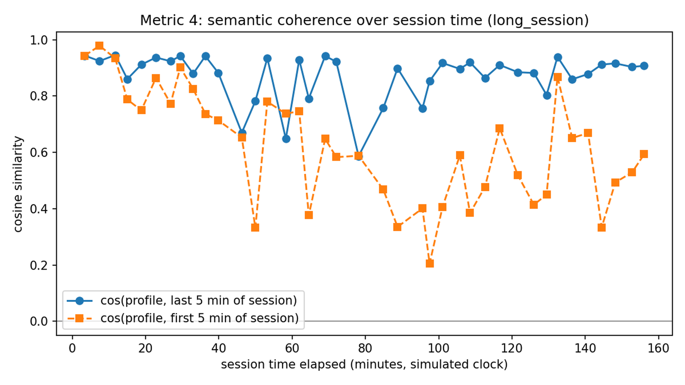
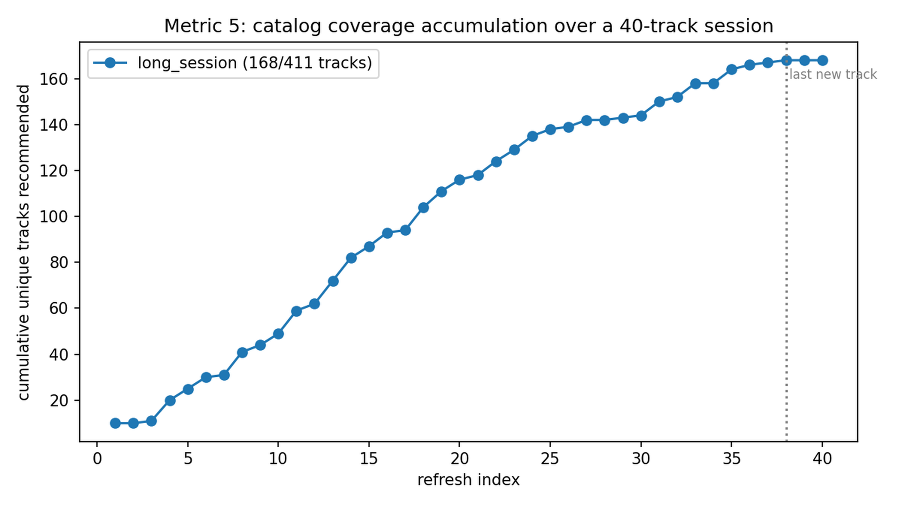
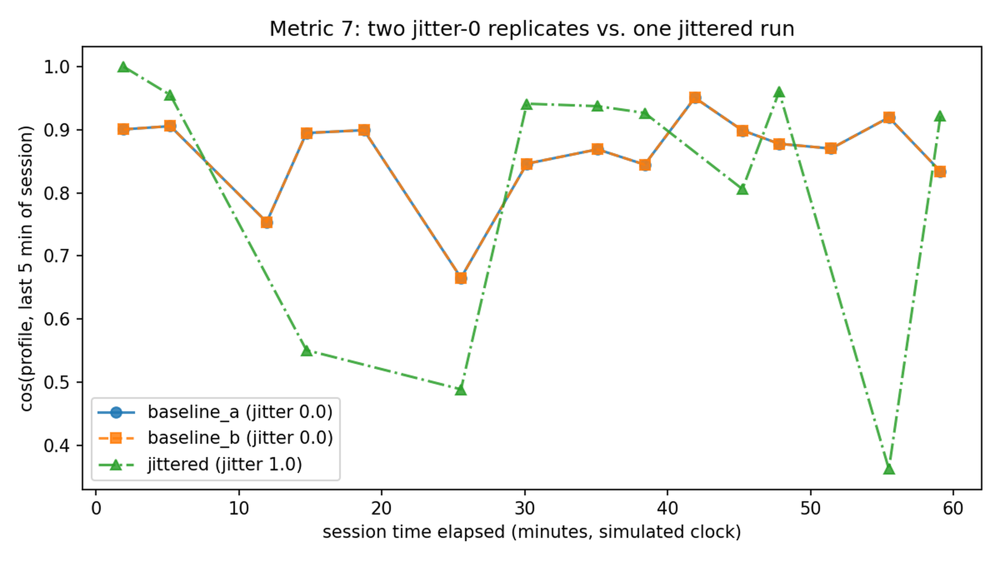

# 6. Streaming Use Cases: 8.2 and 8.3

Chapter 5 built the batch/reactive Recommender Engine over a static catalog. This chapter documents the streaming half of the use-case taxonomy: 8.2 (streaming, reactive), implemented and evaluated in full, and 8.3 (streaming, proactive), set out here as a design with a minimal real demonstration slice (Section 6.2.8) built to show the mechanism working end-to-end — not evaluated to 8.1/8.2's standard, and reporting no metrics or verdict of its own.

The two are independent modules (they share no runtime state and no code path with each other), but both build on the same shared platform, extended for this chapter with the streaming capabilities the batch use case did not need.

## 6.1 Use Case 8.2: Streaming, Reactive

### 6.1.1 Scope: What Actually Changes Relative to 8.1

The taxonomy in Section 4.5 separates 8.1 from 8.2 by processing mode: batch versus streaming. It is worth being precise about what that means in the implementation, because the difference is narrower and more specific than "the same recommender, but faster".

Both use cases are *reactive*: a recommendation is produced because someone asked for one, not because the system decided to volunteer it. What changes is the **context** the recommendation is computed from. In 8.1 the context is a single seed track, a deliberate choice, since no behavioral data existed anywhere in the pipeline at that point (Section 5.3.4). In 8.2 the context is a **live listening session**: an ordered, still-growing sequence of behavioral events (plays, completions, skips with their position in the track, likes), maintained continuously and summarized into a single semantic vector that moves as the session moves.

Three consequences follow, and they account for essentially all of the new work:

- The system needs somewhere for behavioral events to arrive, be durably recorded, and be read back per session, none of which existed after Chapter 5. This is platform work, shared with 8.3 (Section 6.1.3).
- It needs a stateful, continuously updated representation of "what this session sounds like right now", the session profile centroid, computed in Flink over event-time windows (Section 6.1.4).
- It needs recommendations that are *already current* when a client asks, rather than computed on demand, which means a background refresh loop with an explicit policy for how often it may run (Section 6.1.5) and a delivery service that reads what that loop wrote (Section 6.1.6).

The scoring function itself is unchanged. `ranking.score_recommendations()` (the additive weighted sum defined and justified in Section 5.3.4) is reused verbatim by 8.2, after being moved from the 8.1 use-case directory into the shared platform package. The independence rule between use cases (Section 4.5) is a rule about 8.1, 8.2 and 8.3 not depending on *each other*; it was never a rule against either of them depending on the platform, and re-implementing a scoring function that already exists and is already tested would have been the worse outcome. What 8.2 changes is the *input* to that function, not the function.

Figure 6.12 is the original conceptual sketch of this use case, and one honest correction against it is worth stating before the rest of the chapter builds on the real pipeline. The three input streams on the left and the five processing stages both hold up: stream ingestion, incremental feature extraction, and a continuously updated recommendation are exactly what Sections 6.1.4–6.1.6 build. The one part of this picture that was **not** built is the "Other Users Listening Stream" input and the cross-session "Real-Time Similarity Computation" it feeds: this thesis's implemented 8.2 computes a session's profile from that session's own events alone (Section 6.1.4's centroid), with no signal from any other listener's session. The figure is kept here as it was originally conceived, not edited to match the implementation after the fact, precisely so this gap is visible rather than quietly smoothed over — a genuine simplification, not an oversight discovered late.

{width=6.3in}

### 6.1.2 A Correction to the Planned Transport: Request/Response, Not WebSocket

Section 4.5's use-case table originally assigned WebSocket transport to both 8.2 and 8.3. For 8.2 that assignment was revisited during implementation and deliberately reversed: recommendation delivery for 8.2 is an ordinary HTTP request/response API. The reasoning is worth recording, because it is a case where following the earlier plan would have quietly damaged the taxonomy the thesis rests on.

The distinction between 8.2 and 8.3 is *explicit query versus system-inferred suggestion*: whether the user asked. It is not *pull versus push*. Those two axes are easy to conflate because push is the natural transport for a proactive system, but they are not the same axis, and a pushed recommendation is behaviourally proactive whether or not the user asked for it. Building push delivery for 8.2 would therefore have made 8.2 indistinguishable, from the client's point of view, from the use case it is supposed to contrast with. Push belongs to 8.3, or to future work.

This is recorded here rather than silently corrected: the change is a deviation from the architecture as drafted in Chapter 4, of the same kind as the Spark/Flink scope boundary declared in Section 5.1, and Section 4.5's table is amended accordingly.

### 6.1.3 Runtime Environment: The Streaming Prerequisites

Kafka and Redis were provisioned in the Docker Compose environment from the first build stage and left deliberately unwired throughout Chapter 5. Making them load-bearing required six platform stages, built and verified before any 8.2 business logic was written. These are platform stages, not 8.2 stages: 8.3 would reuse every one of them unchanged.

| Stage | Component | What it adds |
|---|---|---|
| 7 | Kafka topics and wiring | `media-stream` and `behavioral-events` created idempotently; producer/consumer round-trip proven against the live broker |
| 8 | Flink provisioning | JobManager and TaskManager on the compose network, registered and idle, provisioning only, no job |
| 9 | Redis session cache | `session:{id}:events` under a sliding 30-minute TTL, written by a Kafka consumer |
| 10 | PostgreSQL sessions/events schema | The same consumer additionally persists every event durably; Redis is a cache, PostgreSQL stays the system of record |
| 11 | Event ingestion service | A separate FastAPI service, `POST /events` → the `behavioral-events` topic |
| 12 | Event simulator | Deterministic, scripted listening sessions replayed against the live catalog, with `--seed` and `--speed` |

: Table 6.1: Platform stages required before 8.2 could begin.

Two design decisions in this list shape everything that follows.

**Behavioral-event ingestion is a separate service, not an endpoint on the Semantic API.** The Semantic API established in Section 5.3.3 is read-only, and that property is worth more than the convenience of adding one write route to it: it is what allows the API to be shared, unchanged, by every Layer-3 consumer. A behavioral event is not a semantic read of catalog content; it is new data entering the pipeline, which is a Layer-1 concern. It therefore enters through its own small service, which does nothing but validate and produce to Kafka.

**The ingestion consumer is platform-owned, and its ownership boundary was fixed before the second consumer existed.** The consumer that reads `behavioral-events` and maintains session state owns *raw* state: the durable PostgreSQL event log and the per-session event list in Redis. The Flink job introduced in the next section owns *derived* state: the session profile vector. They run in separate Kafka consumer groups and neither writes the other's keys. Fixing that split in advance (rather than after both existed and had begun to overlap) is what makes it possible to reason about the failure behaviour measured in Section 6.1.10, where the two are shown to fail differently and independently.

The simulator deserves a note of its own, because the evaluation in Sections 6.1.8–6.1.10 rests on it entirely. There are no real users for this dataset, so behavior must be scripted. The simulator replays canned YAML session scripts against the real 411-track catalog by posting to the ingestion service, with a seeded random stream for reproducibility and a simulated session clock decoupled from wall-clock time via `--speed`. It carries two fields beyond the ingestion service's minimum schema: `event_time`, anchored to a fixed reference instant rather than `now()` so that two runs are byte-identical, and `position_ms`, without which an early skip cannot be distinguished from a late one.

Figure 6.1 shows the resulting runtime: one topic, three independent consumer groups, and a strict separation between the components that compute state and the one that serves it.

{width=6.4in}

### 6.1.4 Stage 13: The Session Profile Centroid

The session profile is 8.2's first piece of genuinely new business logic: a live "what is this session about" signal, computed as a weighted, recency-decayed centroid of the CLAP embeddings of the tracks the session has engaged with, written to Redis and rewritten as the session continues.

It is implemented as a PyFlink job: a Kafka source on `behavioral-events`, event-time watermarks with five seconds of bounded out-of-orderness, keyed by session identifier, over sliding five-minute windows advancing every thirty seconds. Each window fire computes a centroid and writes it to `session:{id}:profile`.

Two properties of that pipeline are load-bearing rather than incidental. **The windows are event-time, not processing-time.** The simulator replays sessions faster than real time, so processing time reflects the replay speed rather than the session's actual pacing; only event time makes a five-minute window mean five minutes *of listening*. This is also the concrete justification for using a stream processor at all rather than a scheduled job, and it is the one property the evaluation deliberately stresses in Section 6.1.9. **The events carry signed weights**, so that the centroid encodes what the listener rejected as well as what they accepted:

| Event | Weight |
|---|---|
| `like` | +1.5 |
| `complete` | +1.0 |
| `skip`, at or past 80% of the track's duration | +0.8 |
| `play` | +0.2 |
| `skip`, other | −0.3 |
| `skip`, before 5000 ms | −1.0 |

: Table 6.2: Behavioral event weights in the session profile centroid. Recency decay is exponential with a half-life of three *events* (a count, not a duration): the most recent event in a window carries full weight, an event *k* positions earlier is scaled by 0.5^(k/3).

Because weights can be negative, the centroid normalizes by the sum of the *absolute* weights rather than the signed sum: dividing by a signed sum that is small or negative would flip or inflate the result in exactly the cases the negative weights exist to express.

Verification was analytical and then live. The three-consecutive-early-skips script, replayed through the running job, drove the session centroid to a cosine of approximately **−0.98** against the high-energy region of the embedding space that the skipped tracks occupy (individual tracks in that region score +0.75 to +0.86), confirmed by reading the vector the live job had actually written to Redis, not by recomputing it offline. Rejection is represented, and it is represented strongly.

One implementation constraint is worth reporting because it has a cost. The Flink Python workers can reach neither Milvus nor the repository's own modules: the job image carries no `pymilvus`, and the platform package is not mounted into the container. Track embeddings are therefore pre-loaded into Redis by a one-off host-side script and read from there by the workers, and the weight table and centroid arithmetic are **duplicated** inside the job rather than imported from the tested reference implementation. The duplication is guarded by a cross-check test on the Redis key format and by both copies having been written against the same specification and validated against the same analytical figures, but it remains duplication, and it is listed as such in Section 6.1.11.

### 6.1.5 Stage 14: The Recommendation Refresh Loop

The refresh loop is what turns a session profile into recommendations. It is an independent Kafka consumer group on the same `behavioral-events` topic, and on each event it makes two decisions: whether to refresh at all, and if so, by which of two paths.

**Whether.** Refreshing on literally every event would put a vector search and two HTTP calls behind every skip. The loop is therefore debounced: at most one refresh per five seconds **or** per three events, whichever comes first, tracked in a small Redis hash per session. The two branches exist for different traffic shapes: the interval branch protects against bursts, the count branch guarantees that a slow session still gets refreshed. Both branches were observed firing in the evaluation, at different replay speeds (Section 6.1.8). A refresh attempt that turns out to be a no-op because the session has too little state does not consume the debounce budget: only the expensive calls need protecting, and a no-op makes none.

**Which path.** Below two raw events, or before the Flink job has written a profile for this session, there is nothing session-shaped to recommend from. Rather than returning nothing, the loop falls back to exactly 8.1's batch path (the context builder and the ranking function from Sections 5.3.4), seeded by the session's first track. The batch use case is, in effect, the streaming use case's cold start. Once a profile exists, the loop switches to the warm path shown in Figure 6.3.

{width=6.4in}

The handoff in Figure 6.2 is a **race, not a threshold**. No event count or timer triggers the switch. The refresh loop simply uses the profile if one is there, and the profile appears whenever the Flink job's watermark has advanced far enough: two independently scheduled consumer groups, on the same topic, with no coordination between them. This is a deliberate consequence of the ownership split described in Section 6.1.3, and Section 6.1.8 measures where the race actually lands.

{width=6.4in}

The warm path (Figure 6.3) differs from 8.1 in exactly one place, and reuses everything else. The acoustic signal is a Milvus nearest-neighbour search over the *profile vector* rather than over a seed track's embedding, which is why the refresh loop opens its own Milvus connection under its own alias, since the Semantic API deliberately exposes no search-by-raw-vector endpoint. That search excludes every track already played in the session at the query level. The genre-sibling and same-artist candidate sets still come from the Semantic API over HTTP, anchored on the session's most recent track (its "active context"), and are then filtered against the played set a *second* time, because Neo4j has no knowledge of session play history and would otherwise readmit an already-played track through the boost path that the vector search had just excluded.

Two behaviours are logged explicitly rather than hidden. A session that has exhausted the novel candidates a 411-track catalog can supply returns fewer than ten recommendations, and says so, rather than padding the list. And the loop tolerates the absence of any ordering guarantee against the raw-state consumer: if the in-hand event is not yet reflected in the session's cached event list, it is merged locally for this computation instead of waiting for the other consumer to catch up.

### 6.1.6 Stage 16: Delivery: Two Daemons and a Session API

Everything described so far computes; nothing yet runs continuously or is reachable by a client. Three processes close that gap.

**Two daemons, not one.** The refresh daemon alone produces nothing at all: the refresh loop reads the raw session event list to decide what to refresh, and the only writer of that list is the raw-state consumer, which, until this stage, also had no daemon. Both therefore ship, as separate modules under the separate consumer group identifiers fixed in Section 6.1.3, sharing only signal handling and logging.

**These daemons commit Kafka offsets; nothing before them did.** Every consumer written earlier in the project runs with auto-commit disabled and never commits, which is correct for what those consumers are: bounded, one-shot reads under throwaway group identifiers, where starting from the earliest retained message is exactly what is wanted. A daemon is the opposite case. It runs under a canonical, stable group identifier; it restarts; and the topic is never purged. Without commits, every restart would replay the entire topic, duplicating events into Redis and rows into the PostgreSQL log. Both daemons commit manually and synchronously *after* the write, giving at-least-once delivery. No existing consumer's configuration changed, since commits are per group.

The corollary is measured rather than assumed: a daemon's *first* start under a canonical group identifier has no committed offset and does drain the whole retained backlog once. On a topic holding 1,820 messages, the raw-state daemon drained 1,780 cacheable events in 7.5 seconds and the refresh daemon performed 571 refreshes in about 11 seconds (roughly 16 ms per cold-start refresh), with zero errors, after which both consumer groups sat at zero lag and a real restart replayed **zero** events.

**The session API computes nothing.** It is a third FastAPI service whose only dependency is Redis: it serves the ranked list, the profile vector and a session status view, all of which the daemons and the Flink job have already written. Producing a recommendation on the read path would put a vector search and two HTTP calls behind a GET and would duplicate the debounce the refresh loop exists to enforce. That Redis is its only dependency falls out of the data rather than being engineered: the rows the refresh loop stores are already self-contained, so nothing needs enriching at read time.

One deliberate detail: a 404 distinguishes two different situations. A wrong session identifier and a real session whose first events have not yet cleared the refresh debounce are entirely different things to a client, and collapsing both into one response would make the second look like a defect. The status endpoint goes further and reports which of the session's keys exist, with a note explaining each absence.

Running the daemons for the first time surfaced two real defects that no prior test could have caught, both of the same shape: every consumer before this point was scoped to a single session or a single test's payloads, whereas a daemon reads *every* session on a topic that has never been purged. A behavioral event's track identifier is a free-form string on a deliberately permissive schema, but the refresh loop indexed catalog identifiers with a bare integer conversion, so the first non-numeric identifier it encountered (left on the never-purged topic by an earlier ingestion-service test) raised an exception and killed the loop. The fix introduced a new "cannot seed this session" outcome, which immediately exposed a second-order defect: the loop decided whether real work had happened by comparing against one specific skip outcome by name, so the *new* skip would have counted as a refresh and spent the debounce budget. Both are now handled by prefix, and both daemon loops contain per-event failures (log, count, commit past the message, continue) rather than exiting, on the principle that a daemon which dies on one poison message is not a daemon.

### 6.1.7 Evaluating 8.2: An Active Harness, and Pre-Registered Rules

The 8.1 evaluation pack reads stored rows: the recommendations were generated once, by a single batch invocation, and every metric is computed against that output rather than against a re-execution of it, whether the rows read are the original frozen table or the validated reconstruction Section 5.5.1 describes. That approach is unavailable here. Use case 8.2 has no frozen output (its output is a Redis key rewritten live by two independently scheduled consumer groups racing on one Kafka topic), so the evaluation must **drive the system and measure it in flight**.

`eval/8_2` therefore starts the Semantic API, the ingestion service and the Flink job itself, and runs a paced event poster, the real raw-state consumer, a refresh driver and a profile poller concurrently, per scenario. Eight scenarios make up a full run, in roughly twenty-five minutes.

Four methodological commitments are worth stating explicitly, since they are what the numbers in the next three sections depend on.

**No accuracy metric is reported, and none could be.** There is no ground truth and there are no real users for this dataset, so precision@k, recall@k and NDCG would all require relevance labels that do not exist. The pack measures systems and behavior (how fast the system adapts, where its latency goes, whether it repeats itself, whether it is reproducible, and what a client sees when a store fails) and says nothing about whether a recommendation is good. This is the same position taken by the 8.1 evaluation pack, for the same reason.

**Every pass/fail rule was pre-registered in code before the run it judges.** The adaptation threshold, the determinism verdict, the late-event verdict and the failure-injection verdict were all committed to the repository before any of the data existed. This matters most where a rule could otherwise have been relaxed after seeing a near-miss.

**Where a comparison needed a noise floor, the noise floor was measured, not assumed.** Two content-identical replicates are run specifically so that the difference between them bounds what run-to-run variation looks like; an effect counts as real only if it strictly exceeds that difference. The alternative (reporting a bare difference between one treated run and one untreated run) is uninterpretable in a system whose debounce is wall-clock while the session clock is compressed.

**Wall-clock and session time are not interchangeable, and the reports say which is which.** The debounce constants are wall-clock; `--speed` compresses only the simulated session clock. A scenario replayed at speed *S* therefore faces a debounce *S* times stricter in session-time terms than production would, which changes how many events fall behind each refresh. Per-operation latencies are unaffected; refresh cadence is not, and is reported per speed.

Two constraints imposed by Flink itself shaped the harness. Because the watermark is stream-wide rather than per key, scenarios run back to back must have scheduled event-time anchors: strictly increasing, at least five minutes apart, and each a whole multiple of the window size from a fixed epoch, so that window boundaries fall identically across runs. And because the topic is never purged and both consumer groups start from the earliest offset, session identifiers must be scoped per invocation; a re-used identifier caused one early sweep to silently replay a previous run's events and report zero adaptation.

### 6.1.8 Results: Reactivity, Latency, and the Cold-Start Handoff

The first three metrics run off a single scenario: a session that plays *K* coherent chillout tracks and then pivots hard to rock, swept over K ∈ {3, 5, 8, 12}.

**Metric 1: reactivity.** The question is how quickly the recommendation set turns over after the listener's taste visibly changes, measured as the Jaccard similarity of each post-pivot recommendation set against the last pre-pivot one. The pre-registered adaptation threshold is Jaccard < 0.3.

{width=6.0in}

Adaptation is immediate, in the strongest sense the metric can express: **every K crosses the threshold at its first post-pivot refresh**, one to two events after the pivot, and remains at or near zero for the rest of the session (Figure 6.4). The reported crossing indices (refresh 4, 5, 7 and 10 for K = 3, 5, 8 and 12) increase with K only because a longer pre-pivot phase means more refreshes happen *before* the pivot; the number of refreshes needed *after* it is one in every case. This is the expected consequence of a three-event recency half-life, and it confirms that the recency decay does what the design intended rather than merely being present in the code.

The result comes with an honesty caveat the pack records in its own output. The specification asserted that each K independently reseeds its track sample, so that the four runs are independent. Measured, they are not: a seeded sequential sample draws from one stream, so the K = 3 track set is a prefix of K = 5, which is a prefix of K = 8, and so on. The nesting is arguably the better design for this particular metric (only the pre-pivot *length* varies while the opening sequence is held fixed), but the four points are not independent samples, and the specification's stated reason for accepting the sweep was factually wrong. Both facts are recorded in the results file rather than corrected silently.

**Metric 2: latency per hop.** Three hops are timed separately: the ingestion POST (H1), the lag between an event and the profile computed from it (H2), and the compute cost of one refresh (H3).

| Hop | n | p50 (s) | p95 (s) | p99 (s) |
|---|---|---|---|---|
| H1: ingest POST | 296 | 0.0072 | 0.0086 | 0.0105 |
| H2: profile compute lag | 138 | 2.1207 | 2.5597 | 2.6516 |
| H3: refresh compute | 116 | 0.0244 | 0.0327 | 0.0908 |
| Event arrival → recommendations updated | 116 | 0.0302 | 0.0394 | 0.0987 |

: Table 6.3: Latency per hop, wall-clock, pooled across all eight scenarios.

{width=5.6in}

The shape of Table 6.3 is the finding, not the absolute values. **H2 dominates by two orders of magnitude** (Figure 6.5), and it is the only hop that waits on a windowed job rather than performing a single operation. Ingestion is 7 ms at the median and a refresh computes in 24 ms (including a Milvus search and two HTTP calls to the Semantic API), so the parts of the pipeline that respond to an event are effectively free relative to the part that *summarizes* the session. This is a direct, quantified cost of the sliding-window design, and it is the number that would have to be revisited before any latency-sensitive deployment: the profile is inherently two to three seconds behind the events it describes, by construction and not by defect.

The debounce statistics confirm that both branches of the refresh policy are real. At replay speed 60, the median refresh had three events behind it (the *count* branch firing first), while at speed 30 the median was two, with the five-second *interval* branch firing first. Pooling the two speeds would have averaged that distinction away entirely.

**Metric 3: the cold-start-to-warm handoff.** Every one of the eight sessions in the pack reached the warm path, in all cases after exactly **one** cold-start refresh.

| Session | Reached warm | Cold-start refreshes | Seconds to first warm | Handoff Jaccard | Same ranking |
|---|---|---|---|---|---|
| pivot, K = 3 | yes | 1 | 5.4 | 0.818 | no |
| pivot, K = 5 | yes | 1 | 5.3 | 0.818 | no |
| pivot, K = 8 | yes | 1 | 5.3 | 0.818 | no |
| pivot, K = 12 | yes | 1 | 5.3 | 0.818 | no |
| long session | yes | 1 | 15.0 | 1.000 | no |
| determinism replicate 1 | yes | 1 | 5.3 | 0.818 | no |
| determinism replicate 2 | yes | 1 | 5.3 | 0.818 | no |
| jittered (late events) | yes | 1 | 8.1 | 0.538 | no |

: Table 6.4: Cold-start to warm-path transition, per session. "Same ranking" asks whether the first warm refresh returned the previous set in the same order.

Two readings of this table are wrong and are guarded against in the data itself. First, the eight rows are **not eight independent observations**: seven of the eight sessions open on the same cold-start seed track, for the sample-nesting reason described under Metric 1, so the recurring 0.818 is one observation repeated rather than a stable average: the pack reports two independent observations, not eight. Second, the long session's handoff Jaccard of **1.000 does not mean nothing changed**: the metric is defined over sets, and the first warm refresh returned the same ten tracks in a *different order*, with the previous top track falling to sixth place. Rather than redefining a pre-registered metric after seeing its result, the pack reports an additional flag alongside it, and that flag is false for every session in the table, including the seven at 0.818.

The transition itself is fast in absolute terms: five seconds and a single batch-path refresh, against a median profile lag of 2.1 seconds. A listener would see one recommendation set derived from their opening track, and everything after that derived from their session.

### 6.1.9 Results: Coherence, Coverage, Determinism, and Late Events

The remaining four metrics use a forty-track, four-genre session and three replicates of the pivot scenario.

**Metric 4: semantic coherence over session time.** Does the profile actually track the *recent* session rather than averaging the whole of it? Measured as the cosine similarity between each profile vector and the mean embedding of the last five minutes of session time, against the same for the first five minutes.

{width=6.0in}

Mean cosine against the recent window was **0.8707**, against the opening window **0.6186**, with 35 of 39 samples (90%) closer to the recent window (Figure 6.6). This is the first direct evidence for the recency decay claimed by the design in Section 6.1.4, previously asserted by a code comment and an analytical check, now measured over a long, genre-switching session.

Choosing the replay speed for this metric exposed a constraint the specification had not anticipated, and it constrains what any future measurement of this kind can claim. Profile writes arrive in **bursts**: a track completion advances session time by most of a track's duration, which advances the watermark past seven or eight thirty-second slides at once, and the job fires them milliseconds apart over a single overwritten Redis key. The resolvable ceiling is therefore **one vector per watermark-advancing event, not one per window fire**, at any polling rate whatsoever. Reported against that ceiling, the harness captured 39 of 41 resolvable writes (95%); reported naively against the analytic window-fire count it would have read as about 13% and looked like a sampling failure.

**Metric 5: catalog coverage and attractor collapse.** The risk this metric exists to detect is a recommender that converges on a small pool of tracks and then re-serves it for the rest of the session. Over forty refreshes in the long session, the system recommended **168 distinct tracks (40.88% of the 411-track catalog)**, with 35 of those 40 refreshes contributing at least one track never recommended before, and the last new track arriving at refresh 38 of 40 (Figure 6.7). The flat tail is two refreshes, or 5%. There is no attractor collapse: the recommendation pool was still moving when the session ended.

{width=6.0in}

**Metric 6: determinism.** Two runs of the same scenario, same seed, same speed, no jitter. The pre-registered rule required equal refresh counts, byte-identical recommendation snapshots at every refresh, and a maximum score delta of exactly 0.0, the last of these justified by the 8.1 evaluation having measured this scoring path's repeated-run noise floor at exactly zero across 41,100 matched pairs. The result is **PASS on all three checks**: 11 refreshes each, all 11 snapshots identical, maximum score delta exactly 0.0. A failure was a genuinely possible outcome here (the system under test contains two independently scheduled consumer groups, a wall-clock debounce and an approximate vector index), and the claim is bounded accordingly: two runs, one K, one speed, on an idle machine.

**Metric 7: late events.** Section 6.1.4 justified event-time windows and a five-second out-of-orderness bound. The audit that preceded this metric established, live, what happens to an event that arrives past that bound: the Flink job has no configured allowed lateness and no side output, so the event is **silently and permanently dropped**, not delayed, not diverted, and never rejoined into a later window. This metric asks the next question: is that drop visible in the recommendations?

| Arm | Jitter | Events delivered late | Max lateness (s) | Refreshes | Adaptation refresh index |
|---|---|---|---|---|---|
| baseline A | 0.0 | 0 / 32 | 0.0 | 11 | 7 |
| baseline B | 0.0 | 0 / 32 | 0.0 | 11 | 7 |
| jittered | 1.0 | **20 / 32** | 648.9 | 12 | 7 |

: Table 6.5: Late-event arms. The two baselines are content-identical replicates; the difference between them is the noise floor the jittered arm's effect must exceed.

{width=6.0in}

The dose was heavy (20 of 32 events delivered past the bound, the worst by nearly eleven minutes), and the metric measured that dose explicitly, since without it a null result would be indistinguishable from "nothing was actually dropped". Three of four measures cleared the zero noise floor: refresh count 11 → 12, maximum reactivity Jaccard delta 0.2500, and maximum coherence delta **0.5574** (Figure 6.8). The profile is measurably corrupted and the recommendation sets genuinely differ.

And yet the adaptation refresh index is **7 in all three arms**. This is the most interesting single result in the pack, because it is the one that contradicts the intuition going in: losing most of a session's pre-pivot profile changes *what* the recommender turns over to, but not *when* it turns over. The recency decay dominates. A pivot is detected from the newest events, which arrive on time and carry the most weight, so the corruption of older history (severe as it is here) does not delay the response.

### 6.1.10 Results: Failure Injection, and the Derived-State TTL Fix

The final metric asks what a **client** sees when a store dies underneath a live session. It could only be asked once a client existed, which is why it was sequenced after the delivery stage rather than with the rest of the evaluation.

It is also measured differently from Metrics 1–7. Those run against harness-owned threads, which is adequate for measuring what the pipeline computes but would make a failure result a claim about the harness. This metric drives the **real deployment** (five processes plus the Flink job, both daemons under their canonical consumer group identifiers), so that committed offsets and restart behaviour are part of what is being measured. Four arms, two replicates each; both replicates agreed on every measure in every arm.

| Arm | Events lost | Recovers without restart | Can the client tell? | Effects beyond control |
|---|---|---|---|---|
| control | 0 | n/a | no | n/a |
| Redis outage | **6** | yes | yes: HTTP 500, during the outage only | events lost, client status, staleness |
| Semantic API outage | 0 | yes | **no** | **none** |
| TTL expiry | 0 | yes | yes: reported as expired raw state | staleness |

: Table 6.6: Failure injection arms. A "pass" verdict means the failure was measured soundly, not that the system behaved well.

**The Redis outage loses events, and the mechanism is a design flaw worth naming.** Six events accepted by the ingestion service never reached the durable PostgreSQL log. Both daemons caught the connection error, counted it, and **committed the offset past the message**, the per-event containment introduced in Section 6.1.6 so that a daemon would not die on one poison message. That handler is right for a poison message and wrong for a dependency outage, and the two are indistinguishable to it. There is no retry, and because the offset advanced, a restart cannot recover the lost events. Both daemons did recover on their own once Redis returned, and a client saw errors only during the outage window.

The same outage also killed the Flink job permanently: its window function writes to Redis, and the compose cluster runs with no checkpointing configured, so its restart strategy is effectively none. Without the harness resubmitting the job between arms, every subsequent arm would have run with no profile at all, a detail that matters for anyone reproducing the experiment.

**The Semantic API outage is indistinguishable from the control, and that is the finding.** No event is lost, because the raw-state daemon does not depend on the Semantic API, and every client request returns 200 throughout. Meanwhile every refresh attempted during the outage fails, and the session's recommendation key silently stops moving, and is served as though current. The reason is precise and fixable: the recommendation key carries **no timestamp of any kind**, unlike the profile key, which has a sibling metadata key recording when it was computed. There is no field a client could read to notice that what it is being served is frozen. This arm passes as a measurement while showing the worst behaviour in the pack.

**The derived-state TTL fix.** The delivery stage had surfaced, and deliberately deferred, an asymmetry: raw session events expire under a sliding thirty-minute TTL, but all four *derived* keys (profile, profile metadata, recommendations and refresh bookkeeping) were written with no expiry at all. The session API could therefore serve recommendations for a session whose raw state had expired hours earlier, and the derived keyspace grew without bound. It was deferred rather than patched on purpose, so that the failure injection could observe the behaviour before it was changed.

| Session written by | events | profile | profile metadata | recommendations | refresh metadata |
|---|---|---|---|---|---|
| pre-fix code | *expired* | −1 | −1 | −1 | −1 |
| post-fix code | 1082 | 1104 | 1104 | 1077 | 1081 |

: Table 6.7: Remaining TTL in seconds, read directly from Redis. −1 is Redis for "exists, never expires".

The fix applies one derived TTL constant to all four keys. Its effect is stated as a **bound rather than a reversal**, because the obvious claim (that derived state now expires before raw state) is false: raw events refresh their TTL on every event, while derived state refreshes only on a refresh or a window close, and a window can close on either side of a session's last event. Measured across 32 derived keys in eight sessions, the derived-minus-raw TTL lands in **[−21 s, +23 s]**. Derived state now expires within about half a minute of its session instead of never.

Two things the *running* of this metric found are worth recording as methodology.

**A suspended machine produced a perfect-looking, invalid arm.** One arm was frozen for twenty hours mid-run by an overnight machine suspend. It completed; it lost no events; its four measures looked entirely ordinary; and it agreed with its own replicate. It was nonetheless not the specified experiment: the debounce is wall-clock and raw session state expires after thirty minutes, so an arm frozen for hours silently becomes a TTL-expiry arm regardless of which failure it was meant to test. A stall detector now compares realised against intended pacing per post, and **a flagged arm is excluded and re-run, never adjusted or reweighted**: a measurement taken under conditions the specification did not describe is a different experiment, not a weaker observation of this one. That entire pack was discarded and the experiment repeated.

**A measure the control cannot have is not comparable to the control.** "Recovers without restart" is undefined in an arm with nothing to recover from. The pre-registered rule compared each arm's *true* against the control's *undefined* and duly reported "the system recovered" as an **effect of the failure**, the opposite of what it means. Such measures are now reported separately and excluded from the effect list. The correction is recorded as post-hoc, and it is worth noting that it *removes* a vacuous effect rather than creating one.

Finally, the TTL fix changed none of the four measures in any of the four arms, and that is expected rather than disappointing: an arm runs about ninety seconds while the TTL is thirty minutes, so no derived key can expire inside one. Reporting the identical numbers as validation of the fix would have been an overclaim; the fix is verified directly, by reading Redis (Table 6.7). Separately, all of Metrics 1–7 were confirmed unchanged by recomputing them from the saved raw records of the earlier run, byte-for-byte, which answers exactly the question a repeat of the twenty-five-minute live run would have answered, at no live cost.

### 6.1.11 Limitations and Open Items

Beyond the caveats already stated in place, six limitations bound what this chapter claims.

- **No accuracy claim is made or possible.** There is no ground truth and no real users; every metric here is a systems or behavior metric. Whether these recommendations are *good* is out of reach for this dataset, exactly as it was for 8.1.
- **Late events are dropped, and the fix is deliberately not implemented.** The Flink job has no allowed lateness and no side output. Adding either would have destroyed the effect Metric 7 exists to quantify, so the decision was left open on purpose; it is the clearest single item of future work in this chapter.
- **Two sample-independence defects are recorded rather than repaired.** The K sweep's track sets are nested, and seven of the eight sessions share one cold-start seed track. Both are visible in the published data, and both mean the corresponding tables contain fewer independent observations than they have rows.
- **The profile computation is duplicated, not shared.** The Flink workers cannot import the tested reference implementation, so the weight table and centroid arithmetic exist twice, kept in step by a cross-check test and by construction rather than by the compiler.
- **Frozen recommendations are undetectable by a client.** The recommendation key carries no timestamp, so a client cannot distinguish current recommendations from ones that stopped updating when a dependency failed. The profile key's sibling metadata key shows the shape of the fix.
- **Every number here comes from a single machine, a single 411-track catalog, and a scripted event stream.** The determinism and failure-injection results in particular are bounded to the conditions in which they were taken, and are reported that way.

### 6.1.12 Summary

| Stage | Outcome |
|---|---|
| 7–12: Streaming platform | Kafka topics and wiring, Flink cluster, Redis session cache, PostgreSQL events schema, ingestion service, deterministic simulator |
| 13: Session profile centroid | PyFlink job, 5 min / 30 s event-time sliding windows, signed and recency-decayed centroid; live-verified at cosine ≈ −0.98 against a rejected region |
| 14: Recommendation refresh loop | Debounced (5 s / 3 events), 8.1's batch path as cold start, profile-vector Milvus search as warm path, played tracks excluded twice |
| 16: Delivery | Two offset-committing daemons and a read-only session API over Redis; backlog drained once, restart replayed zero events |
| 15B–15D: Evaluation | Eight metrics, all pre-registered; late-event audit, active harness, failure injection, derived-state TTL fix |

: Table 6.8: Use case 8.2, stage by stage.

The pipeline adapts to a taste change at the first refresh after it, in one to two events; a refresh costs 24 ms at the median while the windowed profile behind it lags 2.1 seconds; every session reached the session-derived warm path after exactly one batch-path refresh; the profile demonstrably tracks recent rather than whole-session listening; the recommender covered 41% of the catalog over one long session without collapsing onto a fixed pool; and two identical runs produced byte-identical output. Against failures, the system loses events on a cache outage through a containment handler that cannot distinguish a poison message from a dependency being down, and cannot signal staleness at all when its enrichment dependency is unavailable, both of which are reported here as findings rather than as changelog entries, because they are properties of the design and not accidents of the run.

Of the 215 automated tests in the repository, all of which pass, 162 belong to the streaming stages and their evaluation packs.

### 6.1.13 Demonstration

Sections 6.1.1–6.1.12 report what the harness measured. This section shows the same pipeline running against the running example of Section 1.3, continuing directly from Figure 5.7: the same three tracks, "Gates," "Billy Comes Home," and "Give Me Hope," played in sequence as one session rather than queried one at a time.

{width=6.3in}

The list this session returns is not the list Figure 5.7 returned for "Gates" alone: "When the Stars Fall from Grace" now ranks first, a track that appeared nowhere in Chapter 5's single-seed result. This is the cold-start-to-warm handoff of Figure 6.2 made visible on one concrete example: querying "Gates" in isolation (Section 5.7) and playing "Gates" as the opening track of a session that continues through "Billy Comes Home" and "Give Me Hope" are different inputs to the same scoring function, and Section 6.1.5's warm path is what makes the second one session-aware rather than seed-aware. Reaching this state on the live stack required exactly what Section 6.1.5 describes: the raw-state daemon caching three events, the Flink job's window firing once enough event time had passed, and the refresh daemon's debounce re-evaluating on a subsequent event and finding a profile where its previous refresh had found none — the race Figure 6.2 describes, observed rather than staged.

## 6.2 Use Case 8.3: Streaming, Proactive

The third row of the taxonomy in Section 4.5 is streaming and proactive: a suggestion the system offers from what is currently playing, without the listener having asked for anything. What follows is its design, the platform surface it stands on, and what Section 6.1's measurements already determine about it. A minimal real slice of this design has been built and is shown running in Section 6.2.8 — but it reports no evaluation results of its own, and Section 6.2.2 explains why that separation is a methodological commitment rather than a hedge, unaffected by whether a demonstration exists.

### 6.2.1 Scope: What Proactive Actually Changes

Section 6.1.2 fixed the distinction the whole taxonomy rests on. Use cases 8.2 and 8.3 differ by whether the user asked, not by whether the transport pushes or pulls. 8.2 answers an explicit query, which is why its delivery is request/response even though the architecture chapter had specified a WebSocket. 8.3 makes an inference the listener never requested, which is where push delivery properly belongs, and where the taxonomy's second axis finally does some work.

What that changes is smaller than its position in the taxonomy suggests, and the smallness is the finding rather than a disappointment. It changes the trigger and the input modality; it does not change the pipeline. Use case 8.2's recommendation path already runs unbidden: two daemons consume the event topic continuously and rewrite a Redis key on their own schedule, and the session API's entire role is to hand over what has already been computed (Section 6.1.6). Recommendations for a live session are, today, produced proactively and delivered reactively. Use case 8.3 is what happens when the decision to speak moves from the client to the system, and when the signal provoking it is audio arriving in real time rather than a behavioural event naming a track the catalog already holds.

Two consequences follow, running in opposite directions. The first is that 8.3 is cheaper to build than its billing implies, because the machinery that maintains a session's evolving taste is finished, measured, and platform-owned by an explicit decision taken before 8.2 needed it (Section 6.1.3). The second is that what remains is precisely the part this dataset is least equipped to settle, which Section 6.2.7 returns to.

### 6.2.2 Why This Section Reports No Results

Section 6.1.7 committed the evaluation of 8.2 to four methodological rules, and one of them governs this section by construction: every pass/fail rule was pre-registered in code before the run it judges. A use case that has not been built cannot be handed a verdict after the fact without breaking that rule, and breaking it here would retroactively cheapen the results it was adopted to protect.

So no number in this section is an 8.3 measurement. Section 6.2.6 does cite measured values, and every one of them is 8.2's, taken from Tables 6.3 to 6.7 and reported there against a live run. They appear because 8.3 would execute on the same substrate, which makes them inherited bounds rather than predictions: the claim is not that 8.3 would behave a certain way, but that 8.3 could not behave better than a component already measured beneath it. That is a weaker claim than a result and a stronger one than an estimate, and it is the strongest form available to an unimplemented design.

Nothing in Section 6.1 depends on this section. The eight metrics, the eight scenarios and the 162 streaming tests stand whether or not 8.3 is ever built.

This holds equally after Section 6.2.8's demonstration slice was built. A working demonstration answers "does the mechanism run end-to-end", which is a systems question; it does not answer, and was never used to answer, any question this section's pre-registration rule governs. No pass/fail rule was written for it before it ran, so none is reported now — the same rule that forbids retroactively scoring an unbuilt design forbids retroactively scoring a demonstration that was never set up as a measurement in the first place.

### 6.2.3 The Proposed Design

The input is a simulated live stream rather than captured hardware audio: a Creative Commons clip retrieved through the Freesound API (Table 3.1) and replayed as though it were arriving in real time. Simulation is the deliberate choice, for the same reason the behavioural-event simulator of Section 6.1.3 replaced real users: a scripted source can be seeded and replayed, and the determinism result of Metric 6 exists only because every input to 8.2 was reproducible. Hardware capture would trade that away for a realism the evaluation cannot use. This remains a design choice that has never been exercised, and Section 6.2.5 records it as such.

Audio would enter through `media-stream`, the second Kafka topic. It has existed since the first streaming platform stage and has never carried a message, because the L1 architecture separated media from behavioural events before either had a producer, and only the behavioural half has since acquired one. Use case 8.3 would be the first thing to write to it, which is the sense in which the topic split has so far been a design commitment rather than a demonstrated one.

From there the clip would be embedded with CLAP on the live path and classified. Auto-tagging is reused strictly as a classifier: it identifies what is playing and writes nothing to Neo4j during the session. The knowledge graph stays a batch-enriched artifact, exactly as Chapter 5 built it, and the live path only reads it. This is a deliberate narrowing rather than an omission, and it keeps the property that makes the graph trustworthy as a signal, which is that its contents were derived once, deterministically, from the whole catalog.

The recognised track then enters the pipeline as an ordinary behavioural event. There is no second ingestion path and no new state: the classifier's output is a track identity, which is exactly what the existing event schema already carries. Everything downstream of that point is the system Section 6.1 measured. Delivery is where 8.3 diverges again, pushing a suggestion over a WebSocket rather than waiting to be asked.

{width=6.4in}

### 6.2.4 What 8.3 Would Reuse Unchanged

Table 6.1 stated that 8.3 would reuse every platform stage behind 8.2 unchanged. Table 6.9 makes that specific, because a claim of reuse is worth only as much as the evidence that the reused thing works.

| Platform component | What 8.3 would use it for | Evidence it works |
|---|---|---|
| `behavioral-events` topic and ingestion service | The classified track enters as an ordinary event | Sections 6.1.3, 6.1.6 |
| Raw-state consumer and daemon | Session event history in Redis and PostgreSQL | Section 6.1.6: backlog drained once, restart replayed zero events; Table 6.6 for its failure behaviour |
| Flink session-profile job | The evolving taste centroid the suggestion is drawn from | Metric 4: coherence 0.8707 recent against 0.6186 opening |
| Recommendation refresh loop | Candidate generation from the session profile | Metrics 1 and 3: adaptation in one refresh, warm path in one |
| Scoring function (`platform/scoring/ranking.py`) | Ranking, shared with 8.1 since Chapter 5 | Metric 6: byte-identical across two runs |
| Semantic API | Graph and catalog reads on the ranking path | Chapter 5; frozen in `contracts/semantic-api-v1.json` |
| Redis session keyspace and its derived TTL | Profile, recommendations and their expiry | Table 6.7 |
| Event simulator | Reproducible sessions, seeded and speed-controlled | Every scenario in Sections 6.1.8 to 6.1.10 |

: Table 6.9: Platform components 8.3 would reuse without modification, and where each was verified.

The right-hand column is what an unimplemented use case can legitimately claim. None of it is evidence about 8.3, and all of it is evidence about the ground 8.3 would stand on.

### 6.2.5 What Would Have to Be Built

The honest complement is shorter than Table 6.9 and considerably harder.

| Missing piece | Why it does not exist yet | Constraint it would inherit |
|---|---|---|
| Freesound client and `media-stream` producer | Nothing has ever produced to the media topic | Determinism requires a seeded, replayable clip source |
| Live-path CLAP embedding | Embedding is a batch enrichment step today | Adds a hop ahead of H1 in Table 6.3's decomposition |
| Classifier endpoint on the Semantic API | Auto-tagging exists as an architectural sibling, not as code | First addition since the OpenAPI freeze; `contracts/` prescribes diffing the export and updating it in the same change |
| Push transport | Deliberately withheld from 8.2 (Section 6.1.2) | Must signal staleness, per Section 6.2.6 |
| Trigger policy | No principled basis exists on this dataset | Section 6.2.7 |
| `eval/8_3` and its metric specification | No implementation to evaluate | Pre-registered before any run, per Section 6.1.7 |

: Table 6.10: What use case 8.3 would require beyond the existing platform.

One reuse in Table 6.9 carries a caveat worth stating rather than discovering later. The session profile weights events by kind, and its weight table is shaped for behavioural signals: a completed play, a like, an early skip against a late one. A live audio stream produces none of those. "Currently playing" is a weaker and more ambiguous signal than "played to completion", and it arrives continuously rather than at track boundaries. The centroid arithmetic transfers unchanged; the weight table does not, and choosing new weights would be a design decision of the same kind Section 6.1.4 documented for 8.2, requiring the same justification.

Two further items are bookkeeping rather than engineering, but they are triggered by 8.3 specifically. The `contracts/` directory holds only the frozen Semantic API export, on the stated rule that the shared recommendation response shape gets written down once a second independent consumer exists. Use case 8.3 is that consumer, and starting it is what makes the recommendation contract worth freezing.

### 6.2.6 What Section 6.1's Measurements Already Bound

Because 8.3 would run on the measured substrate, four of Section 6.1's results are constraints on it rather than facts about something else. Two are favourable and two are not, and the unfavourable pair is the more interesting, because in each case a property that 8.2 could tolerate becomes one that 8.3 could not.

**The profile is between two and three seconds behind the events it summarises, and a proactive system chooses the moment it speaks.** Table 6.3 puts the windowed profile lag at 2.1 seconds at the median, against 7 milliseconds to ingest an event and 24 milliseconds to compute a refresh. In 8.2 this is invisible: the listener asks, and the state is already there when they do. Use case 8.3 has no such luck, because it picks its own moment, and the moment a proactive recommender most wants to speak is a transition between tracks. That is exactly where a summary two to three seconds stale is most likely to describe the track that just ended rather than the one that just began. The lag is a property of the sliding-window design, not a defect, and Section 6.1.8 already named it as the number a latency-sensitive deployment would have to revisit. A proactive use case is that deployment.

**Adaptation itself is fast enough, and that is measured rather than assumed.** Every K in the reactivity sweep crossed the pre-registered threshold at its first post-pivot refresh, and all eight sessions reached the session-derived warm path after exactly one cold-start refresh, in about five seconds. A trigger that fires on a detected change in listening would have current recommendations behind it within a single refresh. Whatever is hard about 8.3, keeping up with the listener is not.

**A silently dropped event corrupts what the system would say without delaying when it says it.** Metric 7 is the sharpest inherited result in the chapter. Under heavy late delivery the profile was measurably corrupted, with a maximum coherence delta of 0.5574, while the adaptation refresh index stayed at 7 in all three arms: the recency decay dominates, so a pivot is detected from the newest events regardless of how much older history was lost. For 8.2 that combination is reassuring, because responsiveness survives. For 8.3 it inverts. A system that speaks on time from a corrupted profile is worse than one that stays quiet, since an unsolicited wrong suggestion costs more than an absent one, and the metric that establishes the timing is blind to that cost precisely because 8.2 never speaks unbidden.

**A frozen recommendation is undetectable by a client, and push removes the user's ability to bound the damage.** The Semantic API outage arm was indistinguishable from the control: no events lost, every request answered 200, and every refresh failing silently behind a recommendation key that carries no timestamp of any kind. Section 6.1.11 lists this as a limitation. Under proactive delivery it is closer to a precondition, because the asymmetry between the two use cases is exactly the asymmetry between answering and volunteering. When the user asks, a stale answer is still an answer to a question they chose to put; the request bounds the exposure. When the system initiates, nothing bounds it, and a push transport over a frozen key would keep making confident unsolicited claims for as long as the dependency stayed down. The same reasoning applies to the six events lost during the Redis outage, where the containment handler committed the offset past each failed message and left a hole in the session history that nothing downstream can detect. The fix Section 6.1.11 sketches, giving the recommendation key a sibling metadata key of the kind the profile already has, is optional for 8.2 and load-bearing for 8.3.

The derived-state TTL result completes the picture. Derived keys now expire within roughly half a minute of the raw state they summarise, the measured spread being between 21 seconds before and 23 seconds after. A request/response client meeting an expired key gets an empty answer to its own question. A push client meets nothing at all, and the design would have to decide explicitly whether an expired session ends in silence or in a final stale utterance. That is a design question this chapter can pose precisely because the TTL behaviour was measured.

### 6.2.7 The Question the Design Does Not Settle

Everything above is answerable from what exists. One thing is not, and it is the thing that makes 8.3 a distinct use case rather than a different transport: when should the system speak.

Both evaluation packs in this thesis refuse accuracy metrics for the same stated reason. There is no ground truth for this dataset and there are no real users, so precision, recall and NDCG would require relevance labels that do not exist (Sections 5.5.1 and 6.1.7). Whether an unsolicited suggestion is welcome at a given moment is a relevance judgement of exactly that kind, and a stricter one, because it asks not merely whether a recommendation is good but whether it was worth interrupting for. A trigger policy tuned without that signal would be tuned against nothing, and reporting a number for it would be the precise failure both packs were designed to avoid.

This is the honest reason 8.3 is scoped out, and it is a better reason than time. The platform is ready, the pipeline is measured, and the remaining question is one the available data cannot answer. Building a trigger policy anyway would produce a system that emits suggestions on a schedule chosen arbitrarily and defended by nothing, and the thesis would have to say so.

What could still be pre-registered, if 8.3 were built, is worth naming, because the boundary is not where it first appears. Time from track onset to first suggestion, classifier latency as a new hop in Table 6.3's decomposition, suggestion rate per session, how often a suggestion is superseded before a listener could act on it, and whether a client can detect staleness are all systems and behaviour measures, all label-free, and all answerable by the same kind of harness Section 6.1.7 describes. The single measure that would matter most, whether the interruption was welcome, is the one that would require a user study rather than a metric. That is the shape of the future work, and it is a different kind of work from anything in this thesis.

### 6.2.8 A Minimal Demonstration

Everything in Sections 6.2.3–6.2.7 was, until now, unbuilt. A minimal real slice of it was implemented to show the mechanism running end-to-end, continuing the running example of Section 1.3: "Give Me Hope" (#16), the last track of the same three-track session Section 5.7 and Section 6.1's own examples already used.

The slice deliberately does not settle the question Section 6.2.7 raises. It triggers a suggestion on every "now playing" event — the simplest possible trigger, not a data-driven policy for *when* to interrupt — because a demonstration only needs some trigger to show the pipeline working, and inventing a principled one here would be exactly the arbitrary, undefended trigger policy Section 6.2.7 already declined to build. What it does show is every other piece of Section 6.2.3's design actually working together: `media-stream` carrying its first real messages, a live CLAP zero-shot classification (auto-tagging reused as a classifier, writing nothing to Neo4j, as Section 6.2.3 specifies), a suggestion computed by the unmodified Section 5.6.1 scoring function, and delivery over a WebSocket rather than a request/response poll — the one place in this pipeline that pushes.

{width=6.3in}

The suggestion in Figure 6.11 illustrates why this is a demonstration and not an evaluation. It is a strong result on this one example — the same artist, a genre sibling, and 0.854 cosine similarity all agreeing — but one example is not a sample, and the live classifier's own top-3 tags are visibly imperfect (an art-rock/country/pop-rock reading of a track catalogued as rock/pop/indie). This is a real, unhidden observation about applying a general-purpose zero-shot classifier to a small, amateur catalog, consistent with Section 3.2's note that CLAP's training distribution is general-purpose rather than music-specific — but it is one example, not a measurement, and no accuracy claim is made from it. Neither observation is a finding; both are exactly what Section 6.2.2 predicts a demonstration can and cannot show. What the screenshot demonstrates is narrower and more defensible: that the design of Sections 6.2.3–6.2.4 is not merely proposed, it runs, on real data, against the same pipeline Section 6.1 measured.
